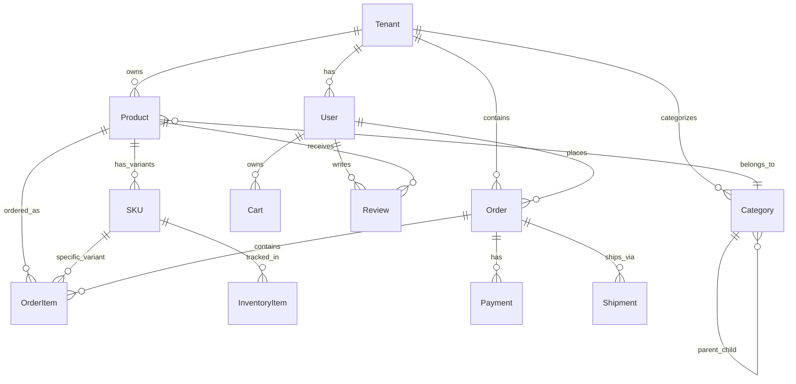

# Tài liệu Kiến trúc Kỹ thuật (TAD)
## Nền tảng E-commerce Multi-tenant

---

### Thông tin tài liệu

**Phiên bản**: 1.0  
**Ngày**: 22 tháng 1, 2026  
**Tác giả**: Đội ngũ Phát triển  
**Trạng thái**: Bản nháp  

---

### Tổng quan Kiến trúc Hệ thống

#### Kiến trúc Cấp cao

```
┌─────────────────────────────────────────────────────────────────┐
│                        Load Balancer                            │
│                    (AWS ALB / Nginx)                           │
└─────────────────────┬───────────────────────────────────────────┘
                      │
┌─────────────────────┴───────────────────────────────────────────┐
│                    CDN / Edge Network                           │
│                  (CloudFlare / AWS CloudFront)                  │
└─────────────────────┬───────────────────────────────────────────┘
                      │
    ┌─────────────────┼─────────────────┐
    │                 │                 │
┌───▼───┐         ┌───▼───┐         ┌───▼───┐
│ Web   │         │ API   │         │ Admin │
│ (Next │         │ (Nest │         │ (Next │
│  JS)  │         │  JS)  │         │  JS)  │
└───┬───┘         └───┬───┘         └───┬───┘
    │                 │                 │
    └─────────────────┼─────────────────┘
                      │
    ┌─────────────────┼─────────────────┐
    │                 │                 │
┌───▼───┐         ┌───▼───┐         ┌───▼───┐
│ Cache │         │ Queue │         │ Search│
│ (Redis│         │ (Bull │         │ (Open │
│ )     │         │  MQ)  │         │Search)│
└───┬───┘         └───┬───┘         └───┬───┘
    │                 │                 │
    └─────────────────┼─────────────────┘
                      │
              ┌───────▼───────┐
              │   Database    │
              │ (PostgreSQL   │
              │ + pgvector)   │
              └───────────────┘
```

#### Multi-Tenant Architecture Pattern

**Shared Database, Shared Schema** with tenant isolation through `tenantId` column:

```
┌─────────────────────────────────────────────────────────────────┐
│                    PostgreSQL Database                          │
├─────────────────────────────────────────────────────────────────┤
│  Table: users                                                   │
│  ├─ id (PK)                                                    │
│  ├─ tenantId (FK) ← Tenant Isolation                           │
│  ├─ email                                                      │
│  ├─ ...                                                        │
├─────────────────────────────────────────────────────────────────┤
│  Table: products                                                │
│  ├─ id (PK)                                                    │
│  ├─ tenantId (FK) ← Tenant Isolation                           │
│  ├─ name                                                       │
│  ├─ ...                                                        │
└─────────────────────────────────────────────────────────────────┘
```

---

### Technology Stack Justification

#### Backend Technology Stack

| Technology | Version | Purpose | Justification |
|------------|---------|---------|---------------|
| **Node.js** | 20+ | Runtime Environment | High performance, large ecosystem, TypeScript support |
| **NestJS** | 11 | Framework | Enterprise-grade architecture, dependency injection, modularity |
| **TypeScript** | 5.0+ | Language | Type safety, better developer experience, maintainability |
| **Prisma** | 6.2.1 | ORM | Type-safe database access, migrations, excellent DX |
| **PostgreSQL** | 15+ | Database | ACID compliance, JSON support, pgvector for AI features |
| **Redis** | 7+ | Cache/Session | High performance caching, session store, job queues |
| **BullMQ** | Latest | Job Queue | Reliable background job processing, Redis-backed |

#### Frontend Technology Stack

| Technology | Version | Purpose | Justification |
|------------|---------|---------|---------------|
| **Next.js** | 16.1 | Framework | SSR/SSG, API routes, excellent performance |
| **React** | 19.2 | UI Library | Component-based architecture, large ecosystem |
| **TailwindCSS** | 4 | Styling | Utility-first, consistent design system |
| **Zustand** | 5 | State Management | Lightweight, TypeScript-friendly |
| **SWR** | 2.3 | Data Fetching | Caching, revalidation, optimistic updates |
| **TypeScript** | 5.0+ | Language | Type safety across frontend/backend |

#### Infrastructure & DevOps

| Technology | Purpose | Justification |
|------------|---------|---------------|
| **Docker** | Containerization | Consistent environments, deployment |
| **Docker Compose** | Local Development | Multi-service orchestration |
| **GitHub Actions** | CI/CD | Integrated with repository, free for OSS |
| **Render** | Hosting | Simple deployment, managed databases |
| **Vercel** | Frontend Hosting | Optimized for Next.js, global CDN |
| **Neon** | Database | Serverless PostgreSQL, auto-scaling |

---

### System Architecture Diagrams

#### 1. Application Layer Architecture

```
┌─────────────────────────────────────────────────────────────────┐
│                        Presentation Layer                      │
├─────────────────────────────────────────────────────────────────┤
│  ┌─────────────┐  ┌─────────────┐  ┌─────────────────────┐   │
│  │   Web App   │  │ Admin Panel │  │   Mobile App (PWA)   │   │
│  │  (Next.js)  │  │ (Next.js)   │  │    (Next.js PWA)     │   │
│  └─────────────┘  └─────────────┘  └─────────────────────┘   │
└─────────────────────┬───────────────────────────────────────────┘
                      │
┌─────────────────────▼───────────────────────────────────────────┐
│                       API Gateway                              │
│                   (NestJS + Express)                           │
├─────────────────────────────────────────────────────────────────┤
│  ┌─────────────┐  ┌─────────────┐  ┌─────────────────────┐   │
│  │   Auth      │  │   Rate      │  │      Validation      │   │
│  │   Guard     │  │   Limiting  │  │      (Zod)           │   │
│  └─────────────┘  └─────────────┘  └─────────────────────┘   │
└─────────────────────┬───────────────────────────────────────────┘
                      │
┌─────────────────────▼───────────────────────────────────────────┐
│                     Business Logic Layer                        │
├─────────────────────────────────────────────────────────────────┤
│  ┌─────────────┐  ┌─────────────┐  ┌─────────────────────┐   │
│  │   Service   │  │ Repository  │  │      Domain         │   │
│  │   Layer     │  │   Layer     │  │      Models         │   │
│  └─────────────┘  └─────────────┘  └─────────────────────┘   │
└─────────────────────┬───────────────────────────────────────────┘
                      │
┌─────────────────────▼───────────────────────────────────────────┐
│                      Data Access Layer                         │
├─────────────────────────────────────────────────────────────────┤
│  ┌─────────────┐  ┌─────────────┐  ┌─────────────────────┐   │
│  │   Prisma    │  │   Redis     │  │    Elasticsearch    │   │
│  │    ORM      │  │    Cache    │  │      Search         │   │
│  └─────────────┘  └─────────────┘  └─────────────────────┘   │
└─────────────────────────────────────────────────────────────────┘
```

#### 2. Multi-Tenant Data Isolation

```
┌─────────────────────────────────────────────────────────────────┐
│                    Application Layer                            │
│                                                                 │
│  ┌─────────────────────────────────────────────────────────┐   │
│  │              Tenant Context Manager                    │   │
│  │                                                         │   │
│  │  ┌─────────────┐  ┌─────────────┐  ┌─────────────┐    │   │
│  │  │   Domain    │  │   Subdomain │  │    Header   │    │   │
│  │  │ Detection   │  │ Detection   │  │ Detection   │    │   │
│  │  └─────────────┘  └─────────────┘  └─────────────┘    │   │
│  └─────────────────────────────────────────────────────────┘   │
└─────────────────────┬───────────────────────────────────────────┘
                      │
┌─────────────────────▼───────────────────────────────────────────┐
│                    Middleware Layer                            │
│                                                                 │
│  ┌─────────────────────────────────────────────────────────┐   │
│  │              Tenant Isolation Middleware               │   │
│  │                                                         │   │
│  │  • Extract tenantId from request                       │   │
│  │  • Validate tenant exists and is active                 │   │
│  │  • Set AsyncLocalStorage context                       │   │
│  │  • Apply tenantId to all database queries              │   │
│  └─────────────────────────────────────────────────────────┘   │
└─────────────────────┬───────────────────────────────────────────┘
                      │
┌─────────────────────▼───────────────────────────────────────────┐
│                     Database Layer                             │
│                                                                 │
│  ┌─────────────────────────────────────────────────────────┐   │
│  │                Shared Database Schema                    │   │
│  │                                                         │   │
│  │  SELECT * FROM products WHERE tenantId = ? AND id = ?  │   │
│  │                                                         │   │
│  │  • All queries automatically filtered by tenantId      │   │
│  │  • Row Level Security (RLS) for additional protection   │   │
│  │  • Audit logging for cross-tenant access attempts      │   │
│  └─────────────────────────────────────────────────────────┘   │
└─────────────────────────────────────────────────────────────────┘
```

#### 3. Caching Architecture

```
┌─────────────────────────────────────────────────────────────────┐
│                        Application                             │
└─────────────────────┬───────────────────────────────────────────┘
                      │
┌─────────────────────▼───────────────────────────────────────────┐
│                    Cache Manager                               │
├─────────────────────────────────────────────────────────────────┤
│  ┌─────────────┐  ┌─────────────┐  ┌─────────────────────┐   │
│  │     L1      │  │     L2      │  │      CDN            │   │
│  │   (In-Memory)│  │  (Redis)   │  │   (CloudFlare)     │   │
│  │             │  │             │  │                     │   │
│  │ • Request   │  │ • Session   │  │ • Static Assets    │   │
│  │ • Response  │  │ • Database  │  │ • API Responses    │   │
│  │ • 1-5 min   │  │ • 1-24 hrs  │  │ • 1-7 days         │   │
│  └─────────────┘  └─────────────┘  └─────────────────────┘   │
└─────────────────────┬───────────────────────────────────────────┘
                      │
┌─────────────────────▼───────────────────────────────────────────┐
│                    Cache Strategies                            │
├─────────────────────────────────────────────────────────────────┤
│                                                                 │
│  • Cache-Aside: Database → Cache → Application                 │
│  • Write-Through: Application → Cache → Database               │
│  • Write-Behind: Application → Cache → Async → Database         │
│  • Cache Invalidation: TTL + Event-driven                      │
│                                                                 │
└─────────────────────────────────────────────────────────────────┘
```

---

### Database Schema Design

#### Core Entity Relationships



#### Key Design Patterns

1. **Soft Delete**: All entities have `deletedAt` column
2. **Audit Trail**: `createdAt`, `updatedAt`, `createdBy`, `updatedBy`
3. **Tenant Isolation**: `tenantId` on all tenant-specific tables
4. **Optimistic Locking**: `version` column for concurrent updates
5. **JSON Columns**: Flexible metadata storage using PostgreSQL JSONB

---

### API Specifications (OpenAPI/Swagger)

#### API Structure

```
/api/v1/
├── auth/
│   ├── POST /login
│   ├── POST /register
│   ├── POST /refresh
│   └── POST /logout
├── users/
│   ├── GET /profile
│   ├── PUT /profile
│   └── GET /:id
├── products/
│   ├── GET /
│   ├── GET /:id
│   ├── POST /
│   ├── PUT /:id
│   └── DELETE /:id
├── orders/
│   ├── GET /
│   ├── GET /:id
│   ├── POST /
│   └── PUT /:id/status
└── cart/
    ├── GET /
    ├── POST /items
    ├── PUT /items/:id
    └── DELETE /items/:id
```

#### API Design Principles

1. **RESTful Design**: Proper HTTP methods and status codes
2. **Versioning**: URL-based versioning (`/api/v1/`)
3. **Pagination**: `limit`, `offset`, `total` in responses
4. **Filtering**: Query parameters for filtering and sorting
5. **Error Handling**: Consistent error response format
6. **Rate Limiting**: Per-tenant and per-user limits

#### Response Format Standards

```typescript
// Success Response
interface ApiResponse<T> {
  data: T;
  meta: {
    total?: number;
    page?: number;
    limit?: number;
  };
  links?: {
    self: string;
    next?: string;
    prev?: string;
  };
}

// Error Response
interface ApiError {
  error: {
    code: string;
    message: string;
    details?: any;
    timestamp: string;
    path: string;
  };
}
```

---

### Security Architecture

#### Authentication & Authorization

```
┌─────────────────────────────────────────────────────────────────┐
│                    Authentication Flow                          │
└─────────────────────┬───────────────────────────────────────────┘
                      │
┌─────────────────────▼───────────────────────────────────────────┐
│                     Login Request                              │
│                                                                 │
│  POST /api/v1/auth/login                                       │
│  { email, password, tenantId }                                 │
└─────────────────────┬───────────────────────────────────────────┘
                      │
┌─────────────────────▼───────────────────────────────────────────┐
│                   Authentication Service                       │
│                                                                 │
│  1. Validate credentials                                        │
│  2. Check tenant status                                         │
│  3. Generate JWT + Refresh Token                                │
│  4. Create session in Redis                                     │
│  5. Log authentication event                                   │
└─────────────────────┬───────────────────────────────────────────┘
                      │
┌─────────────────────▼───────────────────────────────────────────┐
│                     Token Response                             │
│                                                                 │
│  {                                                              │
│    accessToken: "jwt.token",                                    │
│    refreshToken: "refresh.token",                              │
│    expiresIn: 3600,                                            │
│    user: { id, email, role, permissions }                     │
│  }                                                              │
└─────────────────────────────────────────────────────────────────┘
```

#### Security Layers

1. **Network Security**
   - TLS 1.3 for all communications
   - WAF (Web Application Firewall)
   - DDoS protection
   - IP whitelisting for admin access

2. **Application Security**
   - Input validation with Zod schemas
   - SQL injection prevention (Prisma ORM)
   - XSS protection (Content Security Policy)
   - CSRF protection (SameSite cookies)

3. **Data Security**
   - Encryption at rest (AES-256)
   - Encryption in transit (TLS)
   - PII data masking in logs
   - Regular security audits

4. **Infrastructure Security**
   - Container security scanning
   - Secrets management (environment variables)
   - Network segmentation
   - Access logging and monitoring

---

### Performance Requirements

#### Response Time Targets

| Endpoint Type | Target (95th percentile) | Maximum |
|---------------|--------------------------|---------|
| Authentication | <200ms | 500ms |
| Product Search | <500ms | 1s |
| Order Processing | <1s | 2s |
| Dashboard Loading | <2s | 5s |
| File Upload | <5s | 10s |

#### Scalability Architecture

```
┌─────────────────────────────────────────────────────────────────┐
│                      Load Balancer                             │
│                   (Horizontal Scaling)                         │
└─────────────────────┬───────────────────────────────────────────┘
                      │
    ┌─────────────────┼─────────────────┐
    │                 │                 │
┌───▼───┐         ┌───▼───┐         ┌───▼───┐
│ API   │         │ API   │         │ API   │
│ Pod 1 │         │ Pod 2 │         │ Pod N │
└───┬───┘         └───┬───┘         └───┬───┘
    │                 │                 │
    └─────────────────┼─────────────────┘
                      │
┌─────────────────────▼───────────────────────────────────────────┐
│                    Database Cluster                            │
│                   (Read Replicas)                              │
│                                                                 │
│  ┌─────────────┐  ┌─────────────┐  ┌─────────────────────┐   │
│  │   Primary   │  │  Replica 1  │  │     Replica N        │   │
│  │ (Write)     │  │  (Read)     │  │     (Read)           │   │
│  └─────────────┘  └─────────────┘  └─────────────────────┘   │
└─────────────────────────────────────────────────────────────────┘
```

#### Caching Strategy

1. **Application-Level Caching**
   - In-memory cache for frequent lookups
   - Response caching for GET requests
   - Query result caching

2. **Database Caching**
   - Query plan caching
   - Connection pooling
   - Read replicas for scaling

3. **CDN Caching**
   - Static assets (images, CSS, JS)
   - API responses (public data)
   - Geographic distribution

---

### Deployment Architecture

#### Container Strategy

```dockerfile
# Multi-stage Dockerfile example
FROM node:20-alpine AS builder
WORKDIR /app
COPY package*.json ./
RUN npm ci --only=production

FROM node:20-alpine AS runtime
WORKDIR /app
COPY --from=builder /app/node_modules ./node_modules
COPY . .
EXPOSE 8080
CMD ["npm", "start"]
```

#### Environment Configuration

```
┌─────────────────────────────────────────────────────────────────┐
│                    Environment Types                           │
├─────────────────────────────────────────────────────────────────┤
│  Development                                                    │
│  ├─ Local development with Docker Compose                      │
│  ├─ Hot reload enabled                                          │
│  ├─ Debug logging                                               │
│  └─ Mock external services                                      │
├─────────────────────────────────────────────────────────────────┤
│  Staging                                                        │
│  ├─ Production-like environment                                 │
│  ├─ Real external services (sandbox mode)                       │
│  ├─ Performance monitoring                                      │
│  └─ Automated testing                                           │
├─────────────────────────────────────────────────────────────────┤
│  Production                                                     │
│  ├─ High availability setup                                     │
│  ├─ Full monitoring and alerting                                │
│  ├─ Auto-scaling enabled                                        │
│  └─ Backup and disaster recovery                                │
└─────────────────────────────────────────────────────────────────┘
```

#### CI/CD Pipeline

```yaml
# GitHub Actions workflow
name: Deploy to Production
on:
  push:
    branches: [main]

jobs:
  test:
    runs-on: ubuntu-latest
    steps:
      - uses: actions/checkout@v3
      - name: Run tests
        run: npm test
  
  build:
    needs: test
    runs-on: ubuntu-latest
    steps:
      - name: Build Docker image
        run: docker build -t ecommerce-api .
  
  deploy:
    needs: build
    runs-on: ubuntu-latest
    steps:
      - name: Deploy to Render
        run: render deploy
```

---

### Monitoring & Observability

#### Monitoring Stack

```
┌─────────────────────────────────────────────────────────────────┐
│                    Application Metrics                         │
│                                                                 │
│  • Response times                                               │
│  • Error rates                                                  │
│  • Throughput                                                   │
│  • Business metrics (orders, revenue)                           │
└─────────────────────┬───────────────────────────────────────────┘
                      │
┌─────────────────────▼───────────────────────────────────────────┐
│                    Monitoring Stack                            │
├─────────────────────────────────────────────────────────────────┤
│  ┌─────────────┐  ┌─────────────┐  ┌─────────────────────┐   │
│  │ Prometheus  │  │ Grafana     │  │    Sentry           │   │
│  │ (Metrics)   │  │ (Dashboards)│  │  (Error Tracking)  │   │
│  └─────────────┘  └─────────────┘  └─────────────────────┘   │
└─────────────────────┬───────────────────────────────────────────┘
                      │
┌─────────────────────▼───────────────────────────────────────────┐
│                    Alerting                                    │
│                                                                 │
│  • Slack notifications for critical alerts                     │
│  • Email for non-critical issues                               │
│  • PagerDuty for emergency incidents                            │
│  • Automated runbooks for common issues                        │
└─────────────────────────────────────────────────────────────────┘
```

#### Health Checks

```typescript
// Health check endpoints
GET /health          // Basic health check
GET /health/ready    // Readiness probe
GET /health/live     // Liveness probe
GET /health/info     // Application info
GET /health/metrics  // Prometheus metrics
```

#### Logging Strategy

1. **Structured Logging**: JSON format with consistent fields
2. **Log Levels**: ERROR, WARN, INFO, DEBUG
3. **Correlation IDs**: Request tracking across services
4. **Sensitive Data**: Automatic redaction of PII
5. **Log Retention**: 30 days for logs, 1 year for audit trails

---

### Integration Patterns

#### External Service Integrations

```
┌─────────────────────────────────────────────────────────────────┐
│                    Integration Hub                             │
└─────────────────────┬───────────────────────────────────────────┘
                      │
┌─────────────────────▼───────────────────────────────────────────┐
│                    Service Adapters                            │
├─────────────────────────────────────────────────────────────────┤
│  ┌─────────────┐  ┌─────────────┐  ┌─────────────────────┐   │
│  │   Payment   │  │   Shipping  │  │      Email          │   │
│  │  Gateway    │  │   Carrier   │  │     Service         │   │
│  │ Adapter     │  │ Adapter     │  │    Adapter          │   │
│  └─────────────┘  └─────────────┘  └─────────────────────┘   │
└─────────────────────┬───────────────────────────────────────────┘
                      │
┌─────────────────────▼───────────────────────────────────────────┐
│                    Message Queue                               │
│                   (BullMQ + Redis)                            │
└─────────────────────┬───────────────────────────────────────────┘
                      │
┌─────────────────────▼───────────────────────────────────────────┐
│                    Background Workers                          │
│                                                                 │
│  • Payment processing                                          │
│  • Email notifications                                         │
│  • Inventory updates                                           │
│  • Report generation                                            │
└─────────────────────────────────────────────────────────────────┘
```

#### Webhook System

```typescript
// Webhook event structure
interface WebhookEvent {
  id: string;
  tenantId: string;
  eventType: string;
  data: any;
  timestamp: Date;
  retryCount: number;
}

// Webhook delivery flow
Event → Queue → Worker → HTTP POST → Response → Retry/Success
```

---

### Disaster Recovery

#### Backup Strategy

1. **Database Backups**
   - Daily full backups
   - Hourly incremental backups
   - Point-in-time recovery (PITR)
   - Cross-region replication

2. **Application Backups**
   - Container image backups
   - Configuration backups
   - Asset storage backups
   - Version control (Git)

#### Recovery Procedures

```
Incident Detection → Alert → Investigation → Recovery → Post-mortem
```

1. **RTO (Recovery Time Objective)**: 4 hours
2. **RPO (Recovery Point Objective)**: 1 hour
3. **Failover Testing**: Monthly
4. **Disaster Recovery Drills**: Quarterly

---

### Technology Debt Management

#### Code Quality Standards

1. **Linting**: ESLint + Prettier
2. **Type Safety**: Strict TypeScript mode
3. **Testing**: 80% code coverage minimum
4. **Documentation**: JSDoc for all public APIs
5. **Code Reviews**: Required for all changes

#### Performance Monitoring

1. **Bundle Size Analysis**: Monthly
2. **Database Query Optimization**: Quarterly
3. **Memory Leak Detection**: Continuous
4. **Load Testing**: Before major releases

#### Security Reviews

1. **Dependency Scanning**: Weekly
2. **Penetration Testing**: Quarterly
3. **Security Audits**: Annually
4. **Compliance Checks**: Monthly

---

### Approval

**Architecture Committee**: ___________________  
**Date**: ___________________  
**Signature**: ___________________  

**CTO**: ___________________  
**Date**: ___________________  
**Signature**: ___________________  

**Lead Engineer**: ___________________  
**Date**: ___________________  
**Signature**: ___________________
