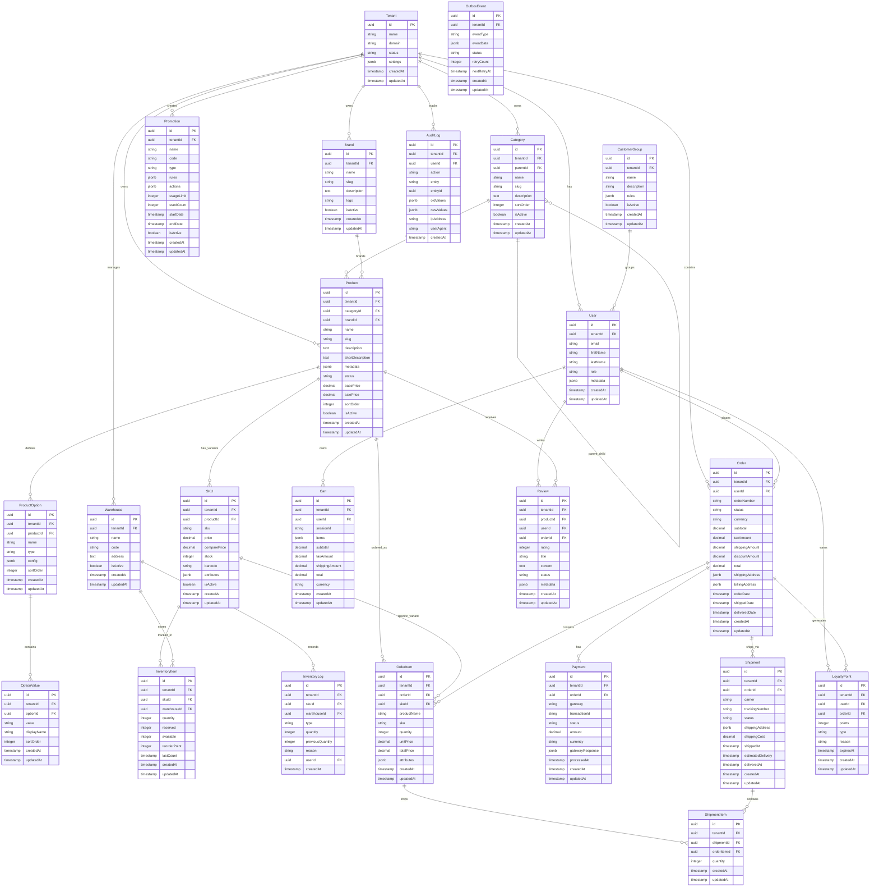

# Database Design Document
## E-commerce Multi-tenant Platform

---

### Document Information

**Version**: 1.0  
**Date**: January 22, 2026  
**Author**: Development Team  
**Status**: Draft  

---

### Database Overview

#### Database Technology Stack

| Component | Technology | Version | Purpose |
|-----------|------------|---------|---------|
| **Primary Database** | PostgreSQL | 15+ | Main data storage with ACID compliance |
| **Vector Extension** | pgvector | Latest | AI-powered semantic search |
| **Cache Layer** | Redis | 7+ | Session storage, caching, job queues |
| **Search Engine** | OpenSearch | Latest | Full-text search and analytics |
| **ORM** | Prisma | 6.2.1 | Type-safe database access |

#### Multi-Tenant Architecture

**Shared Database, Shared Schema** pattern with tenant isolation:

```sql
-- Every tenant-specific table includes tenantId
CREATE TABLE products (
    id UUID PRIMARY KEY DEFAULT gen_random_uuid(),
    tenantId UUID NOT NULL REFERENCES tenants(id),
    name VARCHAR(255) NOT NULL,
    -- ... other fields
    CONSTRAINT products_tenant_check CHECK (tenantId IS NOT NULL)
);

-- Row Level Security for additional protection
ALTER TABLE products ENABLE ROW LEVEL SECURITY;
CREATE POLICY tenant_isolation ON products
    USING (tenantId = current_setting('app.current_tenant_id')::UUID);
```

---

### Entity Relationship Diagram



---

### Table Definitions

#### Core Tables

##### 1. tenants
```sql
CREATE TABLE tenants (
    id UUID PRIMARY KEY DEFAULT gen_random_uuid(),
    name VARCHAR(255) NOT NULL,
    domain VARCHAR(255) UNIQUE NOT NULL,
    status VARCHAR(50) NOT NULL DEFAULT 'active',
    settings JSONB DEFAULT '{}',
    subscriptionPlan VARCHAR(100),
    subscriptionExpiresAt TIMESTAMP,
    createdAt TIMESTAMP DEFAULT CURRENT_TIMESTAMP,
    updatedAt TIMESTAMP DEFAULT CURRENT_TIMESTAMP
);

CREATE INDEX idx_tenants_domain ON tenants(domain);
CREATE INDEX idx_tenants_status ON tenants(status);
```

##### 2. users
```sql
CREATE TABLE users (
    id UUID PRIMARY KEY DEFAULT gen_random_uuid(),
    tenantId UUID NOT NULL REFERENCES tenants(id) ON DELETE CASCADE,
    email VARCHAR(255) NOT NULL,
    passwordHash VARCHAR(255),
    firstName VARCHAR(100),
    lastName VARCHAR(100),
    role VARCHAR(50) NOT NULL DEFAULT 'customer',
    isActive BOOLEAN DEFAULT true,
    emailVerified BOOLEAN DEFAULT false,
    emailVerifiedAt TIMESTAMP,
    lastLoginAt TIMESTAMP,
    metadata JSONB DEFAULT '{}',
    createdAt TIMESTAMP DEFAULT CURRENT_TIMESTAMP,
    updatedAt TIMESTAMP DEFAULT CURRENT_TIMESTAMP,
    
    UNIQUE(tenantId, email)
);

CREATE INDEX idx_users_tenant_email ON users(tenantId, email);
CREATE INDEX idx_users_role ON users(role);
CREATE INDEX idx_users_isActive ON users(isActive);
```

#### Catalog Tables

##### 3. categories
```sql
CREATE TABLE categories (
    id UUID PRIMARY KEY DEFAULT gen_random_uuid(),
    tenantId UUID NOT NULL REFERENCES tenants(id) ON DELETE CASCADE,
    parentId UUID REFERENCES categories(id),
    name VARCHAR(255) NOT NULL,
    slug VARCHAR(255) NOT NULL,
    description TEXT,
    image VARCHAR(500),
    sortOrder INTEGER DEFAULT 0,
    isActive BOOLEAN DEFAULT true,
    metadata JSONB DEFAULT '{}',
    createdAt TIMESTAMP DEFAULT CURRENT_TIMESTAMP,
    updatedAt TIMESTAMP DEFAULT CURRENT_TIMESTAMP,
    
    UNIQUE(tenantId, slug),
    UNIQUE(tenantId, name)
);

CREATE INDEX idx_categories_tenant_id ON categories(tenantId);
CREATE INDEX idx_categories_parent_id ON categories(parentId);
CREATE INDEX idx_categories_slug ON categories(tenantId, slug);
CREATE INDEX idx_categories_isActive ON categories(isActive);
```

##### 4. products
```sql
CREATE TABLE products (
    id UUID PRIMARY KEY DEFAULT gen_random_uuid(),
    tenantId UUID NOT NULL REFERENCES tenants(id) ON DELETE CASCADE,
    categoryId UUID REFERENCES categories(id),
    brandId UUID REFERENCES brands(id),
    name VARCHAR(255) NOT NULL,
    slug VARCHAR(255) NOT NULL,
    description TEXT,
    shortDescription TEXT,
    images JSONB DEFAULT '[]',
    metadata JSONB DEFAULT '{}',
    status VARCHAR(50) NOT NULL DEFAULT 'draft',
    basePrice DECIMAL(10,2),
    salePrice DECIMAL(10,2),
    costPrice DECIMAL(10,2),
    weight DECIMAL(8,3),
    dimensions JSONB,
    tags JSONB DEFAULT '[]',
    sortOrder INTEGER DEFAULT 0,
    isActive BOOLEAN DEFAULT false,
    publishedAt TIMESTAMP,
    createdAt TIMESTAMP DEFAULT CURRENT_TIMESTAMP,
    updatedAt TIMESTAMP DEFAULT CURRENT_TIMESTAMP,
    deletedAt TIMESTAMP,
    
    UNIQUE(tenantId, slug),
    CONSTRAINT products_price_check CHECK (
        (basePrice IS NULL OR basePrice >= 0) AND
        (salePrice IS NULL OR salePrice >= 0) AND
        (costPrice IS NULL OR costPrice >= 0)
    )
);

-- Full-text search index
CREATE INDEX idx_products_search ON products USING gin(
    to_tsvector('english', name || ' ' || COALESCE(description, '') || ' ' || COALESCE(shortDescription, ''))
);

-- Vector search index for AI
ALTER TABLE products ADD COLUMN embedding vector(1536);
CREATE INDEX idx_products_embedding ON products USING ivfflat (embedding vector_cosine_ops);

CREATE INDEX idx_products_tenant_id ON products(tenantId);
CREATE INDEX idx_products_category_id ON products(categoryId);
CREATE INDEX idx_products_brand_id ON products(brandId);
CREATE INDEX idx_products_status ON products(status);
CREATE INDEX idx_products_isActive ON products(isActive);
CREATE INDEX idx_products_basePrice ON products(basePrice);
CREATE INDEX idx_products_salePrice ON products(salePrice);
```

##### 5. skus
```sql
CREATE TABLE skus (
    id UUID PRIMARY KEY DEFAULT gen_random_uuid(),
    tenantId UUID NOT NULL REFERENCES tenants(id) ON DELETE CASCADE,
    productId UUID NOT NULL REFERENCES products(id) ON DELETE CASCADE,
    sku VARCHAR(255) NOT NULL,
    barcode VARCHAR(255),
    price DECIMAL(10,2) NOT NULL,
    comparePrice DECIMAL(10,2),
    costPrice DECIMAL(10,2),
    weight DECIMAL(8,3),
    dimensions JSONB,
    images JSONB DEFAULT '[]',
    attributes JSONB DEFAULT '{}',
    trackInventory BOOLEAN DEFAULT true,
    isActive BOOLEAN DEFAULT true,
    createdAt TIMESTAMP DEFAULT CURRENT_TIMESTAMP,
    updatedAt TIMESTAMP DEFAULT CURRENT_TIMESTAMP,
    deletedAt TIMESTAMP,
    
    UNIQUE(tenantId, sku),
    CONSTRAINT skus_price_check CHECK (
        price >= 0 AND
        (comparePrice IS NULL OR comparePrice >= 0) AND
        (costPrice IS NULL OR costPrice >= 0)
    )
);

CREATE INDEX idx_skus_tenant_id ON skus(tenantId);
CREATE INDEX idx_skus_product_id ON skus(productId);
CREATE INDEX idx_skus_sku ON skus(tenantId, sku);
CREATE INDEX idx_skus_price ON skus(price);
CREATE INDEX idx_skus_isActive ON skus(isActive);
```

#### Order Tables

##### 6. orders
```sql
CREATE TABLE orders (
    id UUID PRIMARY KEY DEFAULT gen_random_uuid(),
    tenantId UUID NOT NULL REFERENCES tenants(id) ON DELETE CASCADE,
    userId UUID REFERENCES users(id),
    orderNumber VARCHAR(100) NOT NULL,
    status VARCHAR(50) NOT NULL DEFAULT 'pending',
    currency VARCHAR(3) NOT NULL DEFAULT 'USD',
    subtotal DECIMAL(10,2) NOT NULL,
    taxAmount DECIMAL(10,2) NOT NULL DEFAULT 0,
    shippingAmount DECIMAL(10,2) NOT NULL DEFAULT 0,
    discountAmount DECIMAL(10,2) NOT NULL DEFAULT 0,
    total DECIMAL(10,2) NOT NULL,
    shippingAddress JSONB NOT NULL,
    billingAddress JSONB NOT NULL,
    notes TEXT,
    internalNotes TEXT,
    orderDate TIMESTAMP DEFAULT CURRENT_TIMESTAMP,
    shippedDate TIMESTAMP,
    deliveredDate TIMESTAMP,
    createdAt TIMESTAMP DEFAULT CURRENT_TIMESTAMP,
    updatedAt TIMESTAMP DEFAULT CURRENT_TIMESTAMP,
    
    UNIQUE(tenantId, orderNumber),
    CONSTRAINT orders_total_check CHECK (total >= 0)
);

CREATE INDEX idx_orders_tenant_id ON orders(tenantId);
CREATE INDEX idx_orders_user_id ON orders(userId);
CREATE INDEX idx_orders_orderNumber ON orders(tenantId, orderNumber);
CREATE INDEX idx_orders_status ON orders(status);
CREATE INDEX idx_orders_orderDate ON orders(orderDate);
CREATE INDEX idx_orders_total ON orders(total);
```

##### 7. order_items
```sql
CREATE TABLE order_items (
    id UUID PRIMARY KEY DEFAULT gen_random_uuid(),
    tenantId UUID NOT NULL REFERENCES tenants(id) ON DELETE CASCADE,
    orderId UUID NOT NULL REFERENCES orders(id) ON DELETE CASCADE,
    skuId UUID NOT NULL REFERENCES skus(id),
    productName VARCHAR(255) NOT NULL,
    productSlug VARCHAR(255),
    sku VARCHAR(255) NOT NULL,
    quantity INTEGER NOT NULL,
    unitPrice DECIMAL(10,2) NOT NULL,
    totalPrice DECIMAL(10,2) NOT NULL,
    attributes JSONB DEFAULT '{}',
    createdAt TIMESTAMP DEFAULT CURRENT_TIMESTAMP,
    updatedAt TIMESTAMP DEFAULT CURRENT_TIMESTAMP,
    
    CONSTRAINT order_items_quantity_check CHECK (quantity > 0),
    CONSTRAINT order_items_price_check CHECK (unitPrice >= 0 AND totalPrice >= 0)
);

CREATE INDEX idx_order_items_tenant_id ON order_items(tenantId);
CREATE INDEX idx_order_items_order_id ON order_items(orderId);
CREATE INDEX idx_order_items_sku_id ON order_items(skuId);
```

#### Inventory Tables

##### 8. inventory_items
```sql
CREATE TABLE inventory_items (
    id UUID PRIMARY KEY DEFAULT gen_random_uuid(),
    tenantId UUID NOT NULL REFERENCES tenants(id) ON DELETE CASCADE,
    skuId UUID NOT NULL REFERENCES skus(id) ON DELETE CASCADE,
    warehouseId UUID NOT NULL REFERENCES warehouses(id) ON DELETE CASCADE,
    quantity INTEGER NOT NULL DEFAULT 0,
    reserved INTEGER NOT NULL DEFAULT 0,
    available INTEGER GENERATED ALWAYS AS (quantity - reserved) STORED,
    reorderPoint INTEGER NOT NULL DEFAULT 0,
    maxStock INTEGER,
    lastCount TIMESTAMP,
    lastCountBy UUID REFERENCES users(id),
    createdAt TIMESTAMP DEFAULT CURRENT_TIMESTAMP,
    updatedAt TIMESTAMP DEFAULT CURRENT_TIMESTAMP,
    
    UNIQUE(tenantId, skuId, warehouseId),
    CONSTRAINT inventory_items_quantity_check CHECK (quantity >= 0 AND reserved >= 0)
);

CREATE INDEX idx_inventory_items_tenant_id ON inventory_items(tenantId);
CREATE INDEX idx_inventory_items_sku_id ON inventory_items(skuId);
CREATE INDEX idx_inventory_items_warehouse_id ON inventory_items(warehouseId);
CREATE INDEX idx_inventory_items_available ON inventory_items(available);
CREATE INDEX idx_inventory_items_reorder_point ON inventory_items(reorderPoint);
```

#### System Tables

##### 9. audit_logs
```sql
CREATE TABLE audit_logs (
    id UUID PRIMARY KEY DEFAULT gen_random_uuid(),
    tenantId UUID REFERENCES tenants(id),
    userId UUID REFERENCES users(id),
    action VARCHAR(100) NOT NULL,
    entity VARCHAR(100) NOT NULL,
    entityId UUID,
    oldValues JSONB,
    newValues JSONB,
    ipAddress INET,
    userAgent TEXT,
    createdAt TIMESTAMP DEFAULT CURRENT_TIMESTAMP
) PARTITION BY RANGE (createdAt);

-- Create monthly partitions
CREATE TABLE audit_logs_2026_01 PARTITION OF audit_logs
    FOR VALUES FROM ('2026-01-01') TO ('2026-02-01');

CREATE INDEX idx_audit_logs_tenant_id ON audit_logs(tenantId);
CREATE INDEX idx_audit_logs_user_id ON audit_logs(userId);
CREATE INDEX idx_audit_logs_entity ON audit_logs(entity);
CREATE INDEX idx_audit_logs_createdAt ON audit_logs(createdAt);
```

---

### Indexes and Constraints

#### Performance Indexes

```sql
-- Composite indexes for common queries
CREATE INDEX idx_products_tenant_active_category ON products(tenantId, isActive, categoryId);
CREATE INDEX idx_orders_tenant_status_date ON orders(tenantId, status, orderDate);
CREATE INDEX idx_order_items_order_sku ON order_items(orderId, skuId);
CREATE INDEX idx_inventory_items_sku_warehouse ON inventory_items(skuId, warehouseId);

-- Partial indexes for better performance
CREATE INDEX idx_products_active ON products(tenantId, slug) WHERE isActive = true AND deletedAt IS NULL;
CREATE INDEX idx_orders_pending ON orders(tenantId, orderDate) WHERE status IN ('pending', 'processing');
CREATE INDEX idx_users_active ON users(tenantId, email) WHERE isActive = true;

-- Functional indexes
CREATE INDEX idx_users_email_lower ON users(tenantId, lower(email));
CREATE INDEX idx_products_name_lower ON products(tenantId, lower(name));
```

#### Foreign Key Constraints

```sql
-- Data integrity constraints
ALTER TABLE products ADD CONSTRAINT fk_products_tenant 
    FOREIGN KEY (tenantId) REFERENCES tenants(id) ON DELETE CASCADE;

ALTER TABLE products ADD CONSTRAINT fk_products_category 
    FOREIGN KEY (categoryId) REFERENCES categories(id) ON DELETE SET NULL;

ALTER TABLE products ADD CONSTRAINT fk_products_brand 
    FOREIGN KEY (brandId) REFERENCES brands(id) ON DELETE SET NULL;

-- Prevent orphaned records
ALTER TABLE order_items ADD CONSTRAINT fk_order_items_order 
    FOREIGN KEY (orderId) REFERENCES orders(id) ON DELETE CASCADE;

ALTER TABLE order_items ADD CONSTRAINT fk_order_items_sku 
    FOREIGN KEY (skuId) REFERENCES skus(id) ON DELETE RESTRICT;
```

#### Check Constraints

```sql
-- Business rule constraints
ALTER TABLE products ADD CONSTRAINT chk_product_prices 
    CHECK (
        (basePrice IS NULL OR basePrice >= 0) AND
        (salePrice IS NULL OR salePrice >= 0) AND
        (salePrice IS NULL OR basePrice IS NULL OR salePrice <= basePrice)
    );

ALTER TABLE orders ADD CONSTRAINT chk_order_totals 
    CHECK (
        subtotal >= 0 AND
        taxAmount >= 0 AND
        shippingAmount >= 0 AND
        discountAmount >= 0 AND
        total >= 0
    );

ALTER TABLE users ADD CONSTRAINT chk_user_email 
    CHECK (email ~* '^[A-Za-z0-9._%+-]+@[A-Za-z0-9.-]+\.[A-Za-z]{2,}$');
```

---

### Database Views

#### Materialized Views for Analytics

```sql
-- Product sales summary
CREATE MATERIALIZED VIEW product_sales_summary AS
SELECT 
    p.tenantId,
    p.id as productId,
    p.name,
    p.slug,
    COALESCE(SUM(oi.quantity), 0) as totalSold,
    COALESCE(SUM(oi.totalPrice), 0) as totalRevenue,
    COALESCE(AVG(r.rating), 0) as averageRating,
    COUNT(DISTINCT r.id) as reviewCount
FROM products p
LEFT JOIN order_items oi ON p.id = oi.productId
LEFT JOIN reviews r ON p.id = r.productId
WHERE p.deletedAt IS NULL
GROUP BY p.tenantId, p.id, p.name, p.slug;

CREATE INDEX idx_product_sales_summary_tenant ON product_sales_summary(tenantId);
CREATE INDEX idx_product_sales_summary_product ON product_sales_summary(productId);

-- Customer order summary
CREATE MATERIALIZED VIEW customer_order_summary AS
SELECT 
    u.tenantId,
    u.id as userId,
    u.email,
    u.firstName,
    u.lastName,
    COUNT(DISTINCT o.id) as orderCount,
    COALESCE(SUM(o.total), 0) as totalSpent,
    MIN(o.orderDate) as firstOrderDate,
    MAX(o.orderDate) as lastOrderDate,
    AVG(o.total) as averageOrderValue
FROM users u
LEFT JOIN orders o ON u.id = o.userId
WHERE u.isActive = true
GROUP BY u.tenantId, u.id, u.email, u.firstName, u.lastName;

CREATE INDEX idx_customer_order_summary_tenant ON customer_order_summary(tenantId);
CREATE INDEX idx_customer_order_summary_user ON customer_order_summary(userId);
```

#### Refresh Strategy

```sql
-- Function to refresh materialized views
CREATE OR REPLACE FUNCTION refresh_analytics_views()
RETURNS void AS $$
BEGIN
    REFRESH MATERIALIZED VIEW CONCURRENTLY product_sales_summary;
    REFRESH MATERIALIZED VIEW CONCURRENTLY customer_order_summary;
END;
$$ LANGUAGE plpgsql;

-- Schedule refresh every hour (requires pg_cron extension)
SELECT cron.schedule('refresh-analytics', '0 * * * *', 'SELECT refresh_analytics_views();');
```

---

### Migration Scripts

#### Initial Migration

```sql
-- 001_initial_schema.sql
-- Create extension for vector search
CREATE EXTENSION IF NOT EXISTS vector;
CREATE EXTENSION IF NOT EXISTS pg_trgm;

-- Create UUID generation function
CREATE EXTENSION IF NOT EXISTS "uuid-ossp";

-- Enable necessary extensions
CREATE EXTENSION IF NOT EXISTS "btree_gin";
CREATE EXTENSION IF NOT EXISTS "btree_gist";

-- Create custom types
CREATE TYPE order_status AS ENUM (
    'pending',
    'processing',
    'shipped',
    'delivered',
    'cancelled',
    'refunded'
);

CREATE TYPE payment_status AS ENUM (
    'pending',
    'processing',
    'completed',
    'failed',
    'refunded',
    'partially_refunded'
);

-- Create enums for other entities...
```

#### Data Migration Strategy

```sql
-- Migration template for safe data updates
BEGIN;

-- Create backup table
CREATE TABLE products_backup AS TABLE products;

-- Add new column
ALTER TABLE products ADD COLUMN new_column VARCHAR(255);

-- Update data in batches
DO $$
DECLARE
    batch_size INT := 1000;
    offset_val INT := 0;
    affected_rows INT;
BEGIN
    LOOP
        UPDATE products 
        SET new_column = generate_default_value()
        WHERE id IN (
            SELECT id FROM products 
            ORDER BY id 
            LIMIT batch_size 
            OFFSET offset_val
        );
        
        GET DIAGNOSTICS affected_rows = ROW_COUNT;
        EXIT WHEN affected_rows = 0;
        
        offset_val := offset_val + batch_size;
        COMMIT;
    END LOOP;
END $$;

-- Add constraints
ALTER TABLE products ADD CONSTRAINT chk_new_column CHECK (new_column IS NOT NULL);

COMMIT;
```

---

### Seed Data Strategy

#### Development Seed Data

```sql
-- Seed tenants
INSERT INTO tenants (id, name, domain, status) VALUES
('550e8400-e29b-41d4-a716-446655440001', 'Demo Store', 'demo.ecommerce.com', 'active'),
('550e8400-e29b-41d4-a716-446655440002', 'Test Store', 'test.ecommerce.com', 'active');

-- Seed categories
INSERT INTO categories (tenantId, name, slug, description) VALUES
('550e8400-e29b-41d4-a716-446655440001', 'Electronics', 'electronics', 'Electronic devices and gadgets'),
('550e8400-e29b-41d4-a716-446655440001', 'Clothing', 'clothing', 'Fashion and apparel'),
('550e8400-e29b-41d4-a716-446655440001', 'Books', 'books', 'Books and literature');

-- Seed products with embeddings for AI search
INSERT INTO products (tenantId, categoryId, name, slug, description, basePrice, isActive, embedding) VALUES
('550e8400-e29b-41d4-a716-446655440001', 
 (SELECT id FROM categories WHERE slug = 'electronics'),
 'Laptop Pro 15', 'laptop-pro-15', 
 'High-performance laptop with 15-inch display, 16GB RAM, 512GB SSD',
 1299.99, true,
 embedding_from_text('High-performance laptop with 15-inch display, 16GB RAM, 512GB SSD'));
```

#### Production Seed Data

```sql
-- System configuration data
INSERT INTO system_settings (key, value, description) VALUES
('default_currency', 'USD', 'Default currency for new tenants'),
('max_file_size', '10485760', 'Maximum file upload size in bytes'),
('session_timeout', '1800', 'Session timeout in seconds');

-- Default roles and permissions
INSERT INTO roles (name, description, isSystem) VALUES
('super_admin', 'Platform administrator', true),
('store_owner', 'Store owner', false),
('manager', 'Store manager', false),
('staff', 'Store staff', false),
('customer', 'End customer', false);

-- Default permissions
INSERT INTO permissions (name, resource, action, description) VALUES
('users.create', 'users', 'create', 'Create new users'),
('users.read', 'users', 'read', 'View user information'),
('users.update', 'users', 'update', 'Update user information'),
('users.delete', 'users', 'delete', 'Delete users');
```

---

### Performance Optimization

#### Query Optimization

```sql
-- Optimized product search query
EXPLAIN (ANALYZE, BUFFERS) 
SELECT p.*, c.name as categoryName, b.name as brandName
FROM products p
LEFT JOIN categories c ON p.categoryId = c.id
LEFT JOIN brands b ON p.brandId = b.id
WHERE p.tenantId = $1 
  AND p.isActive = true 
  AND p.deletedAt IS NULL
  AND (
    to_tsvector('english', p.name || ' ' || COALESCE(p.description, '')) @@ plainto_tsquery('english', $2)
    OR p.name ILIKE '%' || $2 || '%'
  )
ORDER BY p.sortOrder, p.name
LIMIT 20 OFFSET $3;
```

#### Database Configuration

```sql
-- PostgreSQL configuration recommendations
-- postgresql.conf

# Memory settings
shared_buffers = 256MB                    # 25% of RAM
effective_cache_size = 1GB                # 75% of RAM
work_mem = 4MB                            # Per connection
maintenance_work_mem = 64MB

# Connection settings
max_connections = 100
shared_preload_libraries = 'pg_stat_statements'

# WAL settings
wal_buffers = 16MB
checkpoint_completion_target = 0.9

# Query planning
random_page_cost = 1.1                    # For SSD
effective_io_concurrency = 200           # For SSD
```

#### Partitioning Strategy

```sql
-- Partition audit logs by month
CREATE TABLE audit_logs (
    id UUID PRIMARY KEY DEFAULT gen_random_uuid(),
    tenantId UUID REFERENCES tenants(id),
    -- ... other columns
    createdAt TIMESTAMP DEFAULT CURRENT_TIMESTAMP
) PARTITION BY RANGE (createdAt);

-- Auto-create partitions function
CREATE OR REPLACE FUNCTION create_monthly_partition(table_name text, start_date date)
RETURNS void AS $$
DECLARE
    partition_name text;
    end_date date;
BEGIN
    partition_name := table_name || '_' || to_char(start_date, 'YYYY_MM');
    end_date := start_date + interval '1 month';
    
    EXECUTE format('CREATE TABLE IF NOT EXISTS %I PARTITION OF %I
                    FOR VALUES FROM (%L) TO (%L)',
                   partition_name, table_name, start_date, end_date);
END;
$$ LANGUAGE plpgsql;
```

---

### Backup and Recovery

#### Backup Strategy

```bash
#!/bin/bash
# backup_database.sh

# Daily full backup
pg_dump -h localhost -U postgres -d ecommerce \
    --format=custom \
    --compress=9 \
    --file="/backups/daily/ecommerce_$(date +%Y%m%d).backup"

# Weekly schema-only backup
pg_dump -h localhost -U postgres -d ecommerce \
    --schema-only \
    --file="/backups/schema/ecommerce_schema_$(date +%Y%m%d).sql"

# Hourly WAL archive
pg_receivewal -h localhost -U postgres -D /backups/wal
```

#### Point-in-Time Recovery

```sql
-- Recovery procedure
-- 1. Stop PostgreSQL
sudo systemctl stop postgresql

# 2. Restore base backup
pg_restore -h localhost -U postgres -d ecommerce_restore \
    /backups/daily/ecommerce_20260122.backup

# 3. Configure recovery
echo "restore_command = 'cp /backups/wal/%f %p'" >> postgresql.conf
echo "recovery_target_time = '2026-01-22 15:30:00'" >> postgresql.conf

# 4. Start PostgreSQL
sudo systemctl start postgresql
```

---

### Monitoring and Maintenance

#### Performance Monitoring

```sql
-- Slow query monitoring
SELECT 
    query,
    calls,
    total_time,
    mean_time,
    rows
FROM pg_stat_statements
WHERE mean_time > 1000  -- queries taking more than 1 second
ORDER BY mean_time DESC
LIMIT 10;

-- Index usage monitoring
SELECT 
    schemaname,
    tablename,
    indexname,
    idx_scan,
    idx_tup_read,
    idx_tup_fetch
FROM pg_stat_user_indexes
ORDER BY idx_scan DESC;

-- Table size monitoring
SELECT 
    schemaname,
    tablename,
    pg_size_pretty(pg_total_relation_size(schemaname||'.'||tablename)) as size
FROM pg_tables
WHERE schemaname = 'public'
ORDER BY pg_total_relation_size(schemaname||'.'||tablename) DESC;
```

#### Maintenance Tasks

```sql
-- Auto-vacuum tuning
ALTER TABLE products SET (
    autovacuum_vacuum_scale_factor = 0.1,
    autovacuum_analyze_scale_factor = 0.05
);

-- Reindex fragmented indexes
REINDEX INDEX CONCURRENTLY idx_products_search;

-- Update table statistics
ANALYZE products;

-- Clean up old data
DELETE FROM audit_logs 
WHERE createdAt < NOW() - INTERVAL '2 years';
```

---

### Security Considerations

#### Data Encryption

```sql
-- Enable transparent data encryption (requires enterprise version)
-- Alternative: Application-level encryption for sensitive columns

CREATE EXTENSION IF NOT EXISTS pgcrypto;

-- Encrypt sensitive data at application level
ALTER TABLE users ADD COLUMN encryptedPhone bytea;

-- Function to encrypt/decrypt
CREATE OR REPLACE FUNCTION encrypt_phone(phone text)
RETURNS bytea AS $$
BEGIN
    RETURN pgp_sym_encrypt(phone, current_setting('app.encryption_key'));
END;
$$ LANGUAGE plpgsql SECURITY DEFINER;
```

#### Access Control

```sql
-- Create read-only user for reporting
CREATE USER reporting_user WITH PASSWORD 'secure_password';
GRANT CONNECT ON DATABASE ecommerce TO reporting_user;
GRANT USAGE ON SCHEMA public TO reporting_user;
GRANT SELECT ON ALL TABLES IN SCHEMA public TO reporting_user;

-- Row Level Security policies
ALTER TABLE orders ENABLE ROW LEVEL SECURITY;
CREATE POLICY tenant_isolation ON orders
    USING (tenantId = current_setting('app.current_tenant_id')::UUID);

CREATE POLICY admin_full_access ON orders
    USING (current_setting('app.user_role') = 'super_admin');
```

---

### Approval

**Database Architect**: ___________________  
**Date**: ___________________  
**Signature**: ___________________  

**Lead Developer**: ___________________  
**Date**: ___________________  
**Signature**: ___________________  

**DevOps Engineer**: ___________________  
**Date**: ___________________  
**Signature**: ___________________
