# Quản lý Rủi ro
## Nền tảng E-commerce Multi-tenant

---

### Thông tin tài liệu

**Phiên bản**: 1.0  
**Ngày**: 22 tháng 1, 2026  
**Tác giả**: Đội ngũ Quản lý Rủi ro  
**Trạng thái**: Bản nháp  

---

### Tổng quan Quản lý Rủi ro

#### Framework Quản lý Rủi ro

1. **Risk Identification**: Xác định rủi ro tiềm ẩn
2. **Risk Assessment**: Đánh giá tác động và xác suất
3. **Risk Mitigation**: Triển khai biện pháp giảm thiểu
4. **Risk Monitoring**: Theo dõi và báo cáo rủi ro
5. **Risk Review**: Đánh giá định kỳ và cập nhật

#### Phân loại Rủi ro

```mermaid
graph TD
    A[Rủi ro Dự án] --> B[Kỹ thuật]
    A --> C[Kinh doanh]
    A --> D[Vận hành]
    A --> E[An ninh]
    A --> F[Pháp lý]
    
    B --> B1[Hiệu năng]
    B --> B2[Scalability]
    B --> B3[Integration]
    B --> B4[Technical Debt]
    
    C --> C1[Market Adoption]
    C --> C2[Revenue Shortfall]
    C --> C3[Competition]
    C --> C4[Customer Churn]
    
    D --> D1[Team Turnover]
    D --> D2[Resource Constraints]
    D --> D3[Process Issues]
    D --> D4[Vendor Dependencies]
    
    E --> E1[Data Breaches]
    E --> E2[System Vulnerabilities]
    E --> E3[Compliance Violations]
    E --> E4[Insider Threats]
    
    F --> F1[Regulatory Changes]
    F --> F2[License Violations]
    F --> F3[IP Infringement]
    F --> F4[Contract Disputes]
```



---

### Ma trận Rủi ro

#### Rủi ro Kỹ thuật

| Rủi ro | Mức độ | Xác suất | Tác động | Mitigation | Owner |
|--------|--------|----------|----------|-------------|-------|
| **Database Performance** | Cao | Trung bình | System degradation, customer loss | Query optimization, read replicas, caching | Tech Lead |
| **Multi-tenant Security** | Cao | Thấp | Data breach, legal liability | Row-level security, regular audits, penetration testing | Security Engineer |
| **Third-party API Failures** | Trung bình | Cao | Feature unavailability, customer dissatisfaction | Multiple providers, fallback mechanisms, circuit breakers | Backend Lead |
| **Scalability Bottlenecks** | Trung bình | Trung bình | Performance issues under load | Load testing, auto-scaling, performance monitoring | DevOps Lead |
| **Technical Debt Accumulation** | Thấp | Cao | Maintenance costs, feature delays | Code reviews, refactoring sprints, technical debt tracking | Tech Lead |

#### Rủi ro Kinh doanh

| Rủi ro | Mức độ | Xác suất | Tác động | Mitigation | Owner |
|--------|--------|----------|----------|-------------|-------|
| **Slow Customer Acquisition** | Cao | Trung bình | Revenue shortfall, investor concerns | Marketing campaigns, referral programs, pricing adjustments | Product Manager |
| **Competitive Pressure** | Trung bình | Cao | Market share loss, pricing pressure | Feature differentiation, unique value proposition, innovation | CEO |
| **Customer Churn >5%** | Trung bình | Trung bình | Revenue instability, growth issues | Customer success programs, feature improvements, support quality | Customer Success |
| **Pricing Strategy Failure** | Thấp | Trung bình | Revenue targets missed, competitive disadvantage | Market research, A/B testing, competitor analysis | Product Manager |
| **Market Shift** | Thấp | Thấp | Product-market fit issues, pivot required | Market monitoring, agile development, customer feedback | CEO |

#### Rủi ro Vận hành

| Rủi ro | Mức độ | Xác suất | Tác động | Mitigation | Owner |
|--------|--------|----------|----------|-------------|-------|
| **Key Team Member Departure** | Cao | Trung bình | Knowledge loss, timeline delays | Documentation, cross-training, knowledge sharing | HR Manager |
| **Budget Overrun** | Trung bình | Trung bình | Project scope reduction, quality issues | Regular budget reviews, scope control, contingency planning | CFO |
| **Vendor Dependency** | Trung bình | Thấp | Service disruption, cost increases | Multiple vendors, SLAs, exit strategies | Procurement |
| **Process Inefficiencies** | Thấp | Cao | Productivity loss, quality issues | Process optimization, automation, regular reviews | Operations Manager |
| **Communication Breakdown** | Thấp | Trung bình | Misalignment, rework, delays | Regular meetings, clear communication channels, documentation | Project Manager |

---

### Kế hoạch Mitigation Chi tiết

#### Database Performance Risk

```typescript
// api/src/monitoring/performance-monitor.service.ts
export class PerformanceMonitorService {
  private performanceThresholds = {
    queryTime: 500, // ms
    connectionPool: 80, // % utilization
    memoryUsage: 85, // % utilization
    cpuUsage: 80, // % utilization
  };

  async monitorDatabasePerformance(): Promise<PerformanceReport> {
    const metrics = await this.collectDatabaseMetrics();
    
    // Check for performance issues
    const issues = [];
    
    if (metrics.avgQueryTime > this.performanceThresholds.queryTime) {
      issues.push({
        type: 'SLOW_QUERIES',
        severity: 'HIGH',
        message: `Average query time: ${metrics.avgQueryTime}ms`,
        recommendation: 'Review and optimize slow queries',
      });
    }
    
    if (metrics.connectionPoolUtilization > this.performanceThresholds.connectionPool) {
      issues.push({
        type: 'CONNECTION_POOL_EXHAUSTION',
        severity: 'MEDIUM',
        message: `Connection pool utilization: ${metrics.connectionPoolUtilization}%`,
        recommendation: 'Increase connection pool size or optimize queries',
      });
    }
    
    return {
      timestamp: new Date(),
      metrics,
      issues,
      recommendations: this.generateRecommendations(issues),
    };
  }
  
  private generateRecommendations(issues: PerformanceIssue[]): string[] {
    return issues.map(issue => issue.recommendation);
  }
}
```

#### Multi-tenant Security Risk

```typescript
// api/src/security/tenant-security.service.ts
export class TenantSecurityService {
  async validateTenantIsolation(tenantId: string): Promise<SecurityReport> {
    const checks = await Promise.all([
      this.checkRowLevelSecurity(tenantId),
      this.checkDataLeakage(tenantId),
      this.checkCrossTenantAccess(tenantId),
      this.checkAuditTrail(tenantId),
    ]);
    
    const issues = checks.filter(check => !check.passed);
    
    return {
      tenantId,
      timestamp: new Date(),
      status: issues.length === 0 ? 'SECURE' : 'VULNERABLE',
      checks,
      issues,
      recommendations: this.generateSecurityRecommendations(issues),
    };
  }
  
  private async checkRowLevelSecurity(tenantId: string): Promise<SecurityCheck> {
    // Test Row-Level Security policies
    const testQuery = `
      SELECT COUNT(*) FROM products 
      WHERE tenantId = $1 AND pg_has_role(session_user, 'authenticated_user', 'MEMBER')
    `;
    
    try {
      const result = await this.prisma.$queryRawUnsafe(testQuery, tenantId);
      return {
        type: 'ROW_LEVEL_SECURITY',
        passed: true,
        message: 'Row-level security working correctly',
      };
    } catch (error) {
      return {
        type: 'ROW_LEVEL_SECURITY',
        passed: false,
        message: `Row-level security issue: ${error.message}`,
      };
    }
  }
}
```

#### Customer Acquisition Risk

```typescript
// api/src/analytics/acquisition-tracker.service.ts
export class AcquisitionTrackerService {
  private acquisitionTargets = {
    monthlyNewTenants: 15,
    customerAcquisitionCost: 200,
    conversionRate: 0.03,
    trialToPaidRate: 0.25,
  };

  async trackAcquisitionMetrics(): Promise<AcquisitionReport> {
    const metrics = await this.collectAcquisitionMetrics();
    
    const risks = [];
    
    if (metrics.monthlyNewTenants < this.acquisitionTargets.monthlyNewTenants) {
      risks.push({
        type: 'LOW_ACQUISITION',
        severity: 'HIGH',
        current: metrics.monthlyNewTenants,
        target: this.acquisitionTargets.monthlyNewTenants,
        impact: 'Revenue shortfall',
      });
    }
    
    if (metrics.customerAcquisitionCost > this.acquisitionTargets.customerAcquisitionCost) {
      risks.push({
        type: 'HIGH_CAC',
        severity: 'MEDIUM',
        current: metrics.customerAcquisitionCost,
        target: this.acquisitionTargets.customerAcquisitionCost,
        impact: 'Profitability issues',
      });
    }
    
    return {
      timestamp: new Date(),
      metrics,
      risks,
      recommendations: this.generateAcquisitionRecommendations(risks),
    };
  }
}
```

---

### Monitoring và Alerting

#### Risk Dashboard

```typescript
// api/src/risk/risk-dashboard.service.ts
export class RiskDashboardService {
  async getRiskDashboard(): Promise<RiskDashboard> {
    const [technicalRisks, businessRisks, operationalRisks] = await Promise.all([
      this.assessTechnicalRisks(),
      this.assessBusinessRisks(),
      this.assessOperationalRisks(),
    ]);
    
    const overallRiskScore = this.calculateOverallRiskScore({
      technical: technicalRisks,
      business: businessRisks,
      operational: operationalRisks,
    });
    
    return {
      timestamp: new Date(),
      overallRiskScore,
      riskLevel: this.determineRiskLevel(overallRiskScore),
      categories: {
        technical: technicalRisks,
        business: businessRisks,
        operational: operationalRisks,
      },
      topRisks: this.getTopRisks([technicalRisks, businessRisks, operationalRisks]),
      trends: await this.getRiskTrends(),
      recommendations: this.generateOverallRecommendations(overallRiskScore),
    };
  }
  
  private determineRiskLevel(score: number): 'LOW' | 'MEDIUM' | 'HIGH' | 'CRITICAL' {
    if (score < 30) return 'LOW';
    if (score < 60) return 'MEDIUM';
    if (score < 80) return 'HIGH';
    return 'CRITICAL';
  }
}
```

#### Alert Configuration

```yaml
# monitoring/risk-alerts.yml
alerts:
  high_risk_score:
    condition: "risk_score > 80"
    severity: "critical"
    channels: ["slack", "email", "sms"]
    message: "Critical risk level detected: {{risk_score}}"
    
  database_performance:
    condition: "avg_query_time > 1000ms"
    severity: "high"
    channels: ["slack", "email"]
    message: "Database performance degradation: {{avg_query_time}}ms"
    
  customer_churn:
    condition: "monthly_churn_rate > 0.05"
    severity: "medium"
    channels: ["slack", "email"]
    message: "Customer churn rate above threshold: {{monthly_churn_rate}}"
    
  security_incident:
    condition: "security_vulnerability_detected"
    severity: "critical"
    channels: ["slack", "email", "sms", "phone"]
    message: "Security incident detected: {{incident_type}}"
    
  budget_overrun:
    condition: "budget_utilization > 0.9"
    severity: "medium"
    channels: ["slack", "email"]
    message: "Budget utilization high: {{budget_utilization}}%"
```

---

### Incident Response

#### Risk Incident Response Plan

```yaml
# incident-response/risk-incidents.yml
risk_incident_response:
  triggers:
    - "Risk score exceeds threshold"
    - "Multiple high-impact risks identified"
    - "External threat intelligence received"
  
  response_team:
    risk_manager: "Risk Management Lead"
    technical_lead: "Technical Lead"
    business_lead: "Business Lead"
    communications: "Communications Manager"
    
  procedures:
    assessment:
      - "Gather incident information"
      - "Assess impact and urgency"
      - "Determine response level"
      - "Activate response team"
      
    response:
      - "Implement immediate mitigation"
      - "Communicate with stakeholders"
      - "Document response actions"
      - "Monitor effectiveness"
      
    recovery:
      - "Verify risk mitigation"
      - "Update risk assessments"
      - "Implement long-term solutions"
      - "Conduct post-incident review"
      
  communication:
    internal:
      - "Immediate notification to leadership"
      - "Regular updates to response team"
      - "Post-incident report to all staff"
      
    external:
      - "Customer notification if required"
      - "Regulatory reporting if applicable"
      - "Public statement if significant"
```

---

### Risk Reporting

#### Monthly Risk Report

```typescript
// api/src/risk/risk-report.service.ts
export class RiskReportService {
  async generateMonthlyRiskReport(month: string, year: number): Promise<RiskReport> {
    const startDate = new Date(year, month - 1, 1);
    const endDate = new Date(year, month, 0);
    
    const [riskMetrics, incidents, mitigations, trends] = await Promise.all([
      this.getRiskMetrics(startDate, endDate),
      this.getRiskIncidents(startDate, endDate),
      this.getMitigationActions(startDate, endDate),
      this.getRiskTrends(startDate, endDate),
    ]);
    
    return {
      period: `${month}/${year}`,
      generatedAt: new Date(),
      executiveSummary: this.generateExecutiveSummary(riskMetrics),
      riskMetrics,
      incidents,
      mitigations,
      trends,
      keyRisks: this.identifyKeyRisks(riskMetrics),
      recommendations: this.generateMonthlyRecommendations(riskMetrics),
      nextMonthFocus: this.planNextMonthFocus(riskMetrics),
    };
  }
  
  private generateExecutiveSummary(metrics: RiskMetrics): ExecutiveSummary {
    return {
      overallRiskLevel: this.determineRiskLevel(metrics.overallScore),
      keyHighlights: this.identifyHighlights(metrics),
      majorConcerns: this.identifyConcerns(metrics),
      progressStatus: this.assessProgress(metrics),
    };
  }
}
```

#### Risk Metrics Dashboard

```typescript
// api/src/risk/risk-metrics.service.ts
export class RiskMetricsService {
  async calculateRiskMetrics(): Promise<RiskMetrics> {
    const risks = await this.getAllActiveRisks();
    
    return {
      totalRisks: risks.length,
      highRiskCount: risks.filter(r => r.score >= 70).length,
      mediumRiskCount: risks.filter(r => r.score >= 40 && r.score < 70).length,
      lowRiskCount: risks.filter(r => r.score < 40).length,
      
      riskByCategory: this.groupRisksByCategory(risks),
      riskTrends: await this.calculateRiskTrends(risks),
      mitigationEffectiveness: await this.assessMitigationEffectiveness(risks),
      
      keyMetrics: {
        riskExposure: this.calculateRiskExposure(risks),
        riskVelocity: this.calculateRiskVelocity(risks),
        riskAge: this.calculateAverageRiskAge(risks),
        mitigationCoverage: this.calculateMitigationCoverage(risks),
      },
    };
  }
}
```

---

### Risk Governance

#### Risk Committee Charter

```markdown
# Risk Committee Charter

## Mandate
The Risk Committee is responsible for overseeing risk management activities and ensuring appropriate risk mitigation strategies are in place.

## Responsibilities
1. Review and approve risk management policies
2. Monitor risk exposure and mitigation effectiveness
3. Provide guidance on risk appetite and tolerance
4. Ensure regulatory compliance
5. Report to Board of Directors

## Meeting Schedule
- Monthly: Risk review and assessment
- Quarterly: Deep dive on high-risk areas
- Annually: Risk strategy and policy review

## Membership
- Chair: CEO
- Members: CTO, CFO, CRO, Head of Engineering, Head of Product
- Secretary: Risk Manager
- Advisors: Legal Counsel, Compliance Officer

## Decision Making
- Consensus for routine decisions
- Majority vote for significant decisions
- Unanimous required for critical risk decisions
```

#### Risk Appetite Statement

```markdown
# Risk Appetite Statement

## Risk Appetite Framework
Our organization accepts calculated risks that align with our strategic objectives while maintaining appropriate controls.

## Risk Tolerance Levels

### High Risk Appetite
- Innovation and technology adoption
- Market expansion initiatives
- Product development risks

### Medium Risk Appetite
- Operational process improvements
- Vendor relationships
- Customer acquisition strategies

### Low Risk Appetite
- Financial reporting accuracy
- Data security and privacy
- Regulatory compliance
- Customer data protection

## Risk Limits
- Maximum acceptable loss: $500K per incident
- Maximum downtime: 4 hours per incident
- Maximum data loss: 0 records
- Maximum compliance violations: 0 per year
```

---

### Training và Awareness

#### Risk Management Training Program

```yaml
# training/risk-management-training.yml
training_program:
  modules:
    - name: "Risk Management Fundamentals"
      duration: "2 hours"
      audience: "All employees"
      content:
        - "Risk identification techniques"
        - "Risk assessment methodologies"
        - "Reporting procedures"
        - "Personal responsibility"
    
    - name: "Technical Risk Management"
      duration: "4 hours"
      audience: "Technical team"
      content:
        - "Security best practices"
        - "Performance optimization"
        - "Scalability planning"
        - "Technical debt management"
    
    - name: "Business Risk Management"
      duration: "3 hours"
      audience: "Business team"
      content:
        - "Market risk assessment"
        - "Financial risk analysis"
        - "Competitive intelligence"
        - "Customer risk management"
    
    - name: "Incident Response"
      duration: "2 hours"
      audience: "Response team"
      content:
        - "Incident response procedures"
        - "Communication protocols"
        - "Documentation requirements"
        - "Post-incident analysis"

  delivery_methods:
    - "Instructor-led training"
    - "Online modules"
    - "Workshops"
    - "Case studies"
    - "Simulations"

  assessment:
    - "Knowledge quizzes"
    - "Practical exercises"
    - "Scenario-based testing"
    - "Certification exams"
```

---

### Approval

**Risk Management Lead**: ___________________  
**Date**: ___________________  
**Signature**: ___________________  

**CEO**: ___________________  
**Date**: ___________________  
**Signature**: ___________________  

**Board of Directors**: ___________________  
**Date**: ___________________  
**Signature**: ___________________
