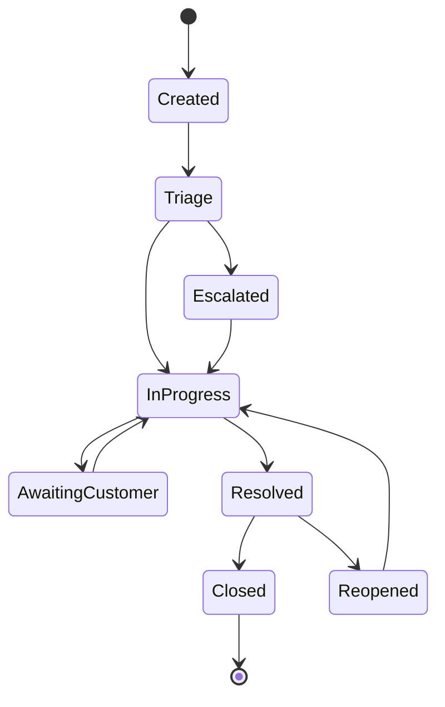

# Hỗ trợ Khách hàng và Vận hành
## Nền tảng E-commerce Multi-tenant

---

### Thông tin tài liệu

**Phiên bản**: 1.0  
**Ngày**: 22 tháng 1, 2026  
**Tác giả**: Đội ngũ Vận hành  
**Trạng thái**: Bản nháp  

---

### Tổng quan Hỗ trợ Khách hàng

#### Mục tiêu Hỗ trợ

1. **Customer Satisfaction**: Đạt 4.5+ rating hài lòng
2. **Response Time**: Phản hồi trong 2 giờ cho các vấn đề cấp bách
3. **Resolution Rate**: Giải quyết 90% tickets trong lần đầu tiên
4. **Self-Service**: 60% khách hàng tự giải quyết qua knowledge base

#### Kênh Hỗ trợ

```
┌─────────────────────────────────────────────────────────────────┐
│                    Customer Support Channels                   │
├─────────────────────────────────────────────────────────────────┤
│  ┌─────────────┐  ┌─────────────┐  ┌─────────────────────┐   │
│  │    Email    │  │   Live Chat │  │    Help Center      │   │
│  │ 24/7 Support│  │ Business Hours│  │   Self-Service     │   │
│  └─────────────┘  └─────────────┘  └─────────────────────┘   │
│  ┌─────────────┐  ┌─────────────┐  ┌─────────────────────┐   │
│  │    Phone    │  │   Social    │  │    Community        │   │
│  │ Business Hrs│  │   Media     │  │   Forum/Discord     │   │
│  └─────────────┘  └─────────────┘  └─────────────────────┘   │
└─────────────────────────────────────────────────────────────────┘
```

---

### Cấu trúc Đội ngũ Hỗ trợ

#### Phân cấp Hỗ trợ

```typescript
// api/src/support/support-tier.service.ts
export class SupportTierService {
  private supportTiers = {
    tier1: {
      name: 'Level 1 Support',
      responsibilities: [
        'Basic troubleshooting',
        'FAQ responses',
        'Ticket triage',
        'Account issues',
        'Password resets',
      ],
      skills: ['Communication', 'Basic technical knowledge', 'Empathy'],
      escalationCriteria: ['Technical issues beyond knowledge', 'Account security concerns', 'Billing disputes'],
    },
    
    tier2: {
      name: 'Level 2 Support',
      responsibilities: [
        'Advanced troubleshooting',
        'Technical investigations',
        'Bug reproduction',
        'Feature explanations',
        'Integration support',
      ],
      skills: ['Technical expertise', 'Problem analysis', 'Product knowledge'],
      escalationCriteria: ['System bugs', 'Security incidents', 'Feature requests', 'Escalated from Tier 1'],
    },
    
    tier3: {
      name: 'Level 3 Support',
      responsibilities: [
        'System architecture issues',
        'Code-level debugging',
        'Performance optimization',
        'Security incidents',
        'Infrastructure problems',
      ],
      skills: ['Development expertise', 'System administration', 'Security knowledge'],
      escalationCriteria: ['Critical system failures', 'Data corruption', 'Security breaches'],
    },
  };
}
```

#### Roles và Responsibilities

| Vai trò | Số lượng | Trách nhiệm chính | Kỹ năng yêu cầu |
|--------|----------|-------------------|-----------------|
| **Support Manager** | 1 | Team leadership, SLA monitoring, reporting | Leadership, analytics, communication |
| **Tier 1 Agents** | 3 | First-line support, ticket triage, basic troubleshooting | Communication, empathy, basic technical |
| **Tier 2 Specialists** | 2 | Technical support, advanced troubleshooting, bug investigation | Technical expertise, problem analysis |
| **Tier 3 Engineers** | 1 | System issues, development support, security incidents | Development, system architecture |
| **Customer Success** | 1 | Onboarding, training, retention, feedback collection | Relationship management, product knowledge |

---

### Ticket Management System

#### Ticket Lifecycle



#### Ticket Classification

```typescript
// api/src/support/ticket-classification.service.ts
export class TicketClassificationService {
  private ticketCategories = {
    technical: {
      subcategories: ['bug_report', 'performance_issue', 'integration_problem', 'feature_request'],
      priority: 'medium',
      tier: 2,
    },
    account: {
      subcategories: ['login_issue', 'password_reset', 'account_settings', 'billing'],
      priority: 'high',
      tier: 1,
    },
    billing: {
      subcategories: ['payment_issue', 'invoice_question', 'subscription_change', 'refund_request'],
      priority: 'high',
      tier: 1,
    },
    feature: {
      subcategories: ['new_feature', 'enhancement', 'documentation', 'training'],
      priority: 'low',
      tier: 2,
    },
    security: {
      subcategories: ['security_concern', 'data_privacy', 'access_issue', 'vulnerability_report'],
      priority: 'critical',
      tier: 3,
    },
  };
  
  classifyTicket(ticketData: TicketData): TicketClassification {
    const category = this.determineCategory(ticketData);
    const priority = this.determinePriority(ticketData, category);
    const tier = this.determineTier(category, priority);
    
    return {
      category,
      subcategory: ticketData.subcategory,
      priority,
      tier,
      estimatedResolutionTime: this.getEstimatedResolutionTime(priority, tier),
      autoAssignment: this.getAutoAssignment(tier),
    };
  }
}
```

#### SLA Configuration

```yaml
# support/sla-configuration.yml
sla_levels:
  critical:
    response_time: "15 minutes"
    resolution_time: "2 hours"
    availability: "24/7"
    escalation_after: "1 hour"
    
  high:
    response_time: "1 hour"
    resolution_time: "8 hours"
    availability: "Business hours"
    escalation_after: "4 hours"
    
  medium:
    response_time: "4 hours"
    resolution_time: "24 hours"
    availability: "Business hours"
    escalation_after: "12 hours"
    
  low:
    response_time: "24 hours"
    resolution_time: "72 hours"
    availability: "Business hours"
    escalation_after: "48 hours"

priority_matrix:
  impact:
    critical: "System down, data loss, security breach"
    high: "Major feature broken, significant business impact"
    medium: "Minor issues, workaround available"
    low: "Cosmetic issues, minor inconveniences"
    
  urgency:
    critical: "Immediate business impact"
    high: "Business impact within 24 hours"
    medium: "Business impact within 1 week"
    low: "No immediate business impact"
```

---

### Knowledge Base Management

#### Knowledge Base Structure

```typescript
// api/src/support/knowledge-base.service.ts
export class KnowledgeBaseService {
  private knowledgeCategories = {
    getting_started: {
      title: 'Getting Started',
      articles: [
        'platform-overview',
        'account-setup',
        'first-store-setup',
        'basic-configuration',
      ],
      targetAudience: ['new_customers'],
    },
    
    features: {
      title: 'Features & Functionality',
      articles: [
        'product-management',
        'order-processing',
        'payment-setup',
        'shipping-configuration',
        'analytics-dashboard',
      ],
      targetAudience: ['all_customers'],
    },
    
    troubleshooting: {
      title: 'Troubleshooting',
      articles: [
        'common-issues',
        'error-codes',
        'performance-problems',
        'integration-issues',
      ],
      targetAudience: ['technical_users'],
    },
    
    advanced: {
      title: 'Advanced Topics',
      articles: [
        'api-integration',
        'custom-themes',
        'advanced-analytics',
        'multi-store-management',
      ],
      targetAudience: ['power_users', 'developers'],
    },
  };
  
  async searchKnowledgeBase(query: string, userRole: string): Promise<SearchResult[]> {
    const results = await this.performSemanticSearch(query);
    
    return results
      .filter(article => this.isAccessibleToUser(article, userRole))
      .map(article => ({
        id: article.id,
        title: article.title,
        excerpt: article.excerpt,
        category: article.category,
        relevance: article.relevanceScore,
        lastUpdated: article.updatedAt,
        helpfulVotes: article.helpfulVotes,
        totalVotes: article.totalVotes,
      }))
      .sort((a, b) => b.relevance - a.relevance)
      .slice(0, 10);
  }
}
```

#### Content Creation Workflow

```yaml
# support/content-workflow.yml
content_creation:
  stages:
    - name: "Topic Identification"
      owner: "Support Manager"
      inputs: ["Customer feedback", "Common tickets", "Feature updates"]
      outputs: ["Content brief"]
      
    - name: "Content Writing"
      owner: "Technical Writer"
      inputs: ["Content brief", "Product documentation"]
      outputs: ["Draft article"]
      
    - name: "Technical Review"
      owner: "Product Team"
      inputs: ["Draft article"]
      outputs: ["Reviewed article"]
      
    - name: "Editorial Review"
      owner: "Support Manager"
      inputs: ["Reviewed article"]
      outputs: ["Final article"]
      
    - name: "Publication"
      owner: "Content Manager"
      inputs: ["Final article"]
      outputs: ["Published article"]
      
  quality_metrics:
    readability_score: "> 70"
    technical_accuracy: "100%"
    customer_helpfulness: "> 80%"
    search_ranking: "Top 5 results"
```

---

### Customer Success Management

#### Onboarding Process

```typescript
// api/src/customer-success/onboarding.service.ts
export class OnboardingService {
  private onboardingSteps = {
    trial_setup: {
      title: 'Trial Account Setup',
      duration: 'Day 1',
      tasks: [
        'Account verification',
        'Basic store configuration',
        'Product catalog setup',
        'Payment gateway testing',
      ],
      owner: 'Customer Success Manager',
    },
    
    training: {
      title: 'Platform Training',
      duration: 'Day 2-3',
      tasks: [
        'Admin dashboard walkthrough',
        'Product management training',
        'Order processing workflow',
        'Analytics overview',
      ],
      owner: 'Customer Success Manager',
    },
    
    launch_preparation: {
      title: 'Go-Live Preparation',
      duration: 'Day 4-5',
      tasks: [
        'Final configuration review',
        'Data migration',
        'Testing workflows',
        'Launch checklist completion',
      ],
      owner: 'Customer Success + Technical',
    },
    
    post_launch: {
      title: 'Post-Launch Support',
      duration: 'Week 1-2',
      tasks: [
        'Daily check-ins',
        'Performance monitoring',
        'Issue resolution',
        'Optimization recommendations',
      ],
      owner: 'Customer Success Manager',
    },
  };
  
  async getOnboardingProgress(tenantId: string): Promise<OnboardingProgress> {
    const completedSteps = await this.getCompletedSteps(tenantId);
    const totalSteps = Object.keys(this.onboardingSteps).length;
    
    return {
      tenantId,
      progressPercentage: (completedSteps.length / totalSteps) * 100,
      completedSteps,
      currentStep: this.getCurrentStep(completedSteps),
      upcomingSteps: this.getUpcomingSteps(completedSteps),
      estimatedCompletion: this.estimateCompletion(completedSteps),
      blockers: await this.identifyBlockers(tenantId),
    };
  }
}
```

#### Health Score Calculation

```typescript
// api/src/customer-success/health-score.service.ts
export class HealthScoreService {
  async calculateCustomerHealthScore(tenantId: string): Promise<HealthScore> {
    const factors = await Promise.all([
      this.getUsageMetrics(tenantId),
      this.getSupportMetrics(tenantId),
      this.getFinancialMetrics(tenantId),
      this.getEngagementMetrics(tenantId),
    ]);
    
    const weights = {
      usage: 0.3,
      support: 0.2,
      financial: 0.3,
      engagement: 0.2,
    };
    
    const weightedScore = 
      factors.usage.score * weights.usage +
      factors.support.score * weights.support +
      factors.financial.score * weights.financial +
      factors.engagement.score * weights.engagement;
    
    return {
      tenantId,
      overallScore: Math.round(weightedScore),
      category: this.categorizeScore(weightedScore),
      factors,
      trends: await this.getHealthTrends(tenantId),
      recommendations: this.generateRecommendations(factors),
      lastUpdated: new Date(),
    };
  }
  
  private categorizeScore(score: number): 'Excellent' | 'Good' | 'At Risk' | 'Critical' {
    if (score >= 80) return 'Excellent';
    if (score >= 60) return 'Good';
    if (score >= 40) return 'At Risk';
    return 'Critical';
  }
}
```

---

### Communication Templates

#### Email Templates

```typescript
// api/src/support/email-templates.service.ts
export class EmailTemplatesService {
  private templates = {
    welcome_email: {
      subject: 'Welcome to E-commerce Platform! 🎉',
      template: 'welcome-email.html',
      variables: ['customer_name', 'tenant_name', 'login_url', 'support_email'],
      triggers: ['account_created'],
    },
    
    ticket_confirmation: {
      subject: 'Ticket #{{ticket_id}} - {{ticket_subject}}',
      template: 'ticket-confirmation.html',
      variables: ['ticket_id', 'ticket_subject', 'customer_name', 'support_url'],
      triggers: ['ticket_created'],
    },
    
    ticket_resolution: {
      subject: 'Ticket #{{ticket_id}} - Resolved ✅',
      template: 'ticket-resolution.html',
      variables: ['ticket_id', 'ticket_subject', 'resolution_summary', 'feedback_url'],
      triggers: ['ticket_resolved'],
    },
    
    onboarding_welcome: {
      subject: 'Let\'s Get Your Store Started! 🚀',
      template: 'onboarding-welcome.html',
      variables: ['customer_name', 'tenant_name', 'onboarding_url', 'contact_person'],
      triggers: ['trial_started'],
    },
    
    health_check_alert: {
      subject: 'Account Health Check - {{health_status}}',
      template: 'health-check-alert.html',
      variables: ['customer_name', 'health_status', 'concerns', 'recommendations'],
      triggers: ['health_score_change'],
    },
  };
  
  async sendTemplateEmail(
    templateKey: string,
    recipient: string,
    variables: Record<string, any>
  ): Promise<void> {
    const template = this.templates[templateKey];
    if (!template) {
      throw new Error(`Template ${templateKey} not found`);
    }
    
    const renderedContent = await this.renderTemplate(template.template, variables);
    
    await this.emailService.send({
      to: recipient,
      subject: this.replaceVariables(template.subject, variables),
      html: renderedContent,
      tracking: {
        templateId: templateKey,
        customerId: variables.customer_id,
        tenantId: variables.tenant_id,
      },
    });
  }
}
```

#### Response Templates

```typescript
// api/src/support/response-templates.service.ts
export class ResponseTemplatesService {
  private responseTemplates = {
    password_reset: {
      title: 'Password Reset Instructions',
      content: 'I can help you reset your password. Please follow these steps...',
      category: 'account',
      tier: 1,
    },
    
    billing_inquiry: {
      title: 'Billing Information',
      content: 'I understand you have questions about your billing. Let me help you with...',
      category: 'billing',
      tier: 1,
    },
    
    technical_troubleshooting: {
      title: 'Technical Troubleshooting Steps',
      content: 'I\'m sorry you\'re experiencing technical issues. Let\'s work through this together...',
      category: 'technical',
      tier: 2,
    },
    
    feature_request: {
      title: 'Feature Request Process',
      content: 'Thank you for your feature suggestion! We appreciate your input...',
      category: 'feature',
      tier: 2,
    },
  };
  
  async getResponseTemplate(
    category: string,
    tier: number,
    keywords: string[]
  ): Promise<ResponseTemplate> {
    const templates = this.responseTemplates[category];
    if (!templates) {
      return this.generateGenericResponse(keywords);
    }
    
    return this.findBestMatch(templates, keywords, tier);
  }
}
```

---

### Performance Metrics

#### Support KPIs

```typescript
// api/src/support/support-metrics.service.ts
export class SupportMetricsService {
  async calculateSupportMetrics(period: 'daily' | 'weekly' | 'monthly'): Promise<SupportMetrics> {
    const dateRange = this.getDateRange(period);
    
    const [ticketMetrics, agentMetrics, customerMetrics] = await Promise.all([
      this.getTicketMetrics(dateRange),
      this.getAgentMetrics(dateRange),
      this.getCustomerMetrics(dateRange),
    ]);
    
    return {
      period,
      dateRange,
      
      // Ticket Metrics
      totalTickets: ticketMetrics.total,
      ticketsByCategory: ticketMetrics.byCategory,
      ticketsByPriority: ticketMetrics.byPriority,
      averageResolutionTime: ticketMetrics.avgResolutionTime,
      firstContactResolution: ticketMetrics.fcrRate,
      
      // Agent Metrics
      agentUtilization: agentMetrics.utilization,
      averageResponseTime: agentMetrics.avgResponseTime,
      customerSatisfaction: agentMetrics.csatScore,
      agentPerformance: agentMetrics.performance,
      
      // Customer Metrics
      customerEffort: customerMetrics.effortScore,
      selfServiceRate: customerMetrics.selfServiceRate,
      knowledgeBaseUsage: customerMetrics.kbUsage,
      
      // Trends
      trends: await this.calculateTrends(dateRange),
      benchmarks: await this.getBenchmarks(),
    };
  }
  
  private async getBenchmarks(): Promise<SupportBenchmarks> {
    return {
      industryAverage: {
        responseTime: 4 * 60 * 60, // 4 hours in seconds
        resolutionTime: 24 * 60 * 60, // 24 hours in seconds
        csatScore: 85,
        fcrRate: 70,
      },
      target: {
        responseTime: 2 * 60 * 60, // 2 hours in seconds
        resolutionTime: 8 * 60 * 60, // 8 hours in seconds
        csatScore: 90,
        fcrRate: 80,
      },
    };
  }
}
```

#### Quality Assurance

```typescript
// api/src/support/quality-assurance.service.ts
export class QualityAssuranceService {
  async reviewTicketQuality(ticketId: string): Promise<QualityReview> {
    const ticket = await this.getTicket(ticketId);
    const interactions = await this.getTicketInteractions(ticketId);
    
    const review = {
      ticketId,
      reviewedAt: new Date(),
      reviewer: 'QA Specialist',
      
      scores: {
        communication: this.scoreCommunication(interactions),
        technicalAccuracy: this.scoreTechnicalAccuracy(interactions),
        customerService: this.scoreCustomerService(interactions),
        efficiency: this.scoreEfficiency(ticket),
        documentation: this.scoreDocumentation(ticket),
      },
      
      overallScore: 0, // Calculated from individual scores
      
      feedback: {
        strengths: this.identifyStrengths(interactions),
        improvements: this.identifyImprovements(interactions),
        recommendations: this.generateRecommendations(interactions),
      },
      
      compliance: this.checkCompliance(interactions),
    };
    
    review.overallScore = this.calculateOverallScore(review.scores);
    return review;
  }
  
  private scoreCommunication(interactions: Interaction[]): number {
    let score = 0;
    
    // Clarity and professionalism
    score += this.assessClarity(interactions) * 0.3;
    
    // Empathy and tone
    score += this.assessEmpathy(interactions) * 0.3;
    
    // Timeliness
    score += this.assessTimeliness(interactions) * 0.2;
    
    // Follow-up
    score += this.assessFollowUp(interactions) * 0.2;
    
    return Math.round(score * 100);
  }
}
```

---

### Automation và AI

#### Chatbot Integration

```typescript
// api/src/support/chatbot.service.ts
export class ChatbotService {
  async handleCustomerMessage(
    message: string,
    customerId: string,
    sessionId: string
  ): Promise<ChatbotResponse> {
    // Analyze message intent
    const intent = await this.analyzeIntent(message);
    
    // Check for quick answers
    const quickAnswer = await this.findQuickAnswer(message);
    if (quickAnswer) {
      return {
        type: 'quick_answer',
        message: quickAnswer.response,
        confidence: quickAnswer.confidence,
        suggestedActions: quickAnswer.actions,
      };
    }
    
    // Check knowledge base
    const kbResults = await this.searchKnowledgeBase(message);
    if (kbResults.length > 0 && kbResults[0].relevance > 0.8) {
      return {
        type: 'knowledge_base',
        message: kbResults[0].content,
        confidence: kbResults[0].relevance,
        relatedArticles: kbResults.slice(1, 3),
      };
    }
    
    // Check for common issues
    const commonIssue = await this.identifyCommonIssue(message);
    if (commonIssue) {
      return {
        type: 'troubleshooting',
        message: commonIssue.steps,
        confidence: commonIssue.confidence,
        escalateToHuman: commonIssue.requiresHuman,
      };
    }
    
    // Default to human agent
    return {
      type: 'escalation',
      message: 'I\'ll connect you with a human agent who can better assist you.',
      confidence: 0.5,
      escalateToHuman: true,
      ticketCreated: await this.createTicket(message, customerId),
    };
  }
  
  private async analyzeIntent(message: string): Promise<Intent> {
    // Use NLP to analyze customer intent
    const intents = [
      'technical_issue',
      'billing_question',
      'feature_request',
      'account_help',
      'general_inquiry',
    ];
    
    // Implementation would use a trained model
    return {
      primary: 'technical_issue',
      confidence: 0.85,
      entities: this.extractEntities(message),
    };
  }
}
```

#### Automated Triage

```typescript
// api/src/support/auto-triage.service.ts
export class AutoTriageService {
  async triageIncomingTicket(ticketData: IncomingTicket): Promise<TriageResult> {
    const analysis = await this.analyzeTicket(ticketData);
    
    const result = {
      ticketId: ticketData.id,
      
      classification: {
        category: analysis.category,
        subcategory: analysis.subcategory,
        priority: analysis.priority,
        urgency: analysis.urgency,
      },
      
      routing: {
        assignedTier: analysis.recommendedTier,
        assignedAgent: await this.findBestAgent(analysis),
        escalationRules: analysis.escalationConditions,
      },
      
      automation: {
        autoResponses: await this.generateAutoResponses(analysis),
        suggestedActions: analysis.suggestedActions,
        knowledgeBaseArticles: await this.findRelevantArticles(analysis),
      },
      
      confidence: analysis.confidence,
      requiresHumanReview: analysis.confidence < 0.8,
    };
    
    await this.applyTriage(result);
    return result;
  }
  
  private async findBestAgent(analysis: TicketAnalysis): Promise<string> {
    const availableAgents = await this.getAvailableAgents(analysis.recommendedTier);
    
    // Find agent with best match based on:
    // 1. Current workload
    // 2. Expertise in category
    // 3. Historical performance
    // 4. Language/timezone match
    
    return availableAgents.reduce((best, current) => {
      const bestScore = this.calculateAgentScore(best, analysis);
      const currentScore = this.calculateAgentScore(current, analysis);
      return currentScore > bestScore ? current : best;
    }).id;
  }
}
```

---

### Reporting và Analytics

#### Support Dashboard

```typescript
// api/src/support/support-dashboard.service.ts
export class SupportDashboardService {
  async getSupportDashboard(timeRange: TimeRange): Promise<SupportDashboard> {
    const [metrics, trends, alerts, teamPerformance] = await Promise.all([
      this.getCurrentMetrics(timeRange),
      this.getTrends(timeRange),
      this.getActiveAlerts(),
      this.getTeamPerformance(timeRange),
    ]);
    
    return {
      timeRange,
      generatedAt: new Date(),
      
      overview: {
        totalTickets: metrics.totalTickets,
        openTickets: metrics.openTickets,
        overdueTickets: metrics.overdueTickets,
        customerSatisfaction: metrics.csatScore,
        averageResponseTime: metrics.avgResponseTime,
      },
      
      performance: {
        slaCompliance: metrics.slaCompliance,
        firstContactResolution: metrics.fcrRate,
        agentUtilization: metrics.agentUtilization,
        selfServiceRate: metrics.selfServiceRate,
      },
      
      trends,
      alerts,
      teamPerformance,
      
      recommendations: this.generateRecommendations(metrics),
      upcomingTasks: this.getUpcomingTasks(),
    };
  }
}
```

#### Customer Insights

```typescript
// api/src/support/customer-insights.service.ts
export class CustomerInsightsService {
  async generateCustomerInsights(tenantId: string): Promise<CustomerInsights> {
    const [supportHistory, usagePatterns, feedback, healthScore] = await Promise.all([
      this.getSupportHistory(tenantId),
      this.getUsagePatterns(tenantId),
      this.getCustomerFeedback(tenantId),
      this.getHealthScore(tenantId),
    ]);
    
    return {
      tenantId,
      generatedAt: new Date(),
      
      supportProfile: {
        totalTickets: supportHistory.total,
        averageResolutionTime: supportHistory.avgResolutionTime,
        commonIssues: supportHistory.commonIssues,
        satisfactionScore: supportHistory.csatScore,
        supportTrend: supportHistory.trend,
      },
      
      usageProfile: {
        featureAdoption: usagePatterns.featureAdoption,
        loginFrequency: usagePatterns.loginFrequency,
        peakUsageTimes: usagePatterns.peakTimes,
        growthTrajectory: usagePatterns.growth,
      },
      
      feedbackProfile: {
        overallSentiment: feedback.sentiment,
        commonThemes: feedback.themes,
        improvementSuggestions: feedback.suggestions,
        recentFeedback: feedback.recent,
      },
      
      riskIndicators: this.identifyRiskIndicators({
        supportHistory,
        usagePatterns,
        feedback,
        healthScore,
      }),
      
      recommendations: this.generateCustomerRecommendations({
        supportHistory,
        usagePatterns,
        feedback,
        healthScore,
      }),
    };
  }
}
```

---

### Approval

**Customer Success Manager**: ___________________  
**Date**: ___________________  
**Signature**: ___________________  

**Support Manager**: ___________________  
**Date**: ___________________  
**Signature**: ___________________  

**Head of Operations**: ___________________  
**Date**: ___________________  
**Signature**: ___________________
