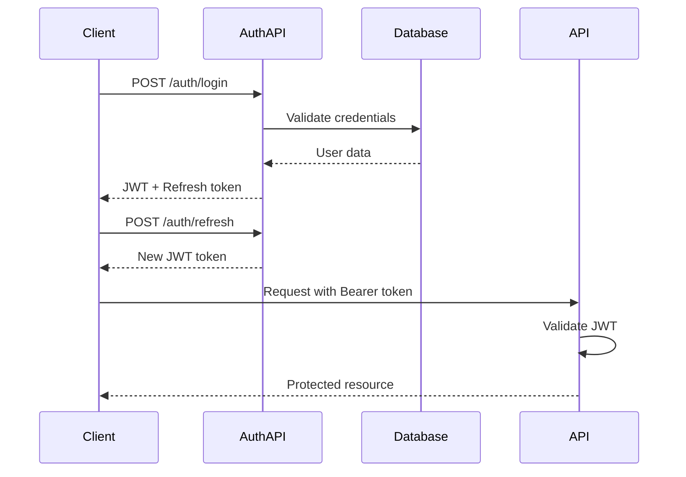

# Tài liệu API
## Nền tảng E-commerce Multi-tenant

---

### Thông tin tài liệu

**Phiên bản**: 1.0  
**Ngày**: 22 tháng 1, 2026  
**Tác giả**: Đội ngũ Phát triển API  
**Trạng thái**: Bản nháp  
**Phiên bản API**: v1  
**URL Cơ sở**: `https://api.ecommerce-platform.com/v1`  

---

### Tổng quan về API

#### Nguyên tắc Kiến trúc

1. **Thiết kế RESTful**: Tuân thủ quy ước REST và ngữ nghĩa HTTP
2. **Hỗ trợ Multi-tenant**: Cách ly tenant thông qua headers/subdomains
3. **Phiên bản hóa**: Phiên bản hóa dựa trên URL để tương thích ngược
4. **Tính nhất quán**: Định dạng phản hồi và xử lý lỗi tiêu chuẩn hóa
5. **Bảo mật**: Xác thực, ủy quyền và giới hạn tốc độ

#### Điểm cuối Cơ sở

| Môi trường | URL Cơ sở | Mô tả |
|------------|-----------|-------|
| **Phát triển** | `http://localhost:8080/v1` | Môi trường phát triển local |
| **Staging** | `https://staging-api.ecommerce-platform.com/v1` | Môi trường staging |
| **Sản xuất** | `https://api.ecommerce-platform.com/v1` | Môi trường sản xuất |

---

### Xác thực & Ủy quyền

#### Phương thức Xác thực

**JWT Bearer Token**:
```http
Authorization: Bearer <jwt_token>
```

**API Key**:
```http
X-API-Key: <api_key>
```

**Tenant Identification**:
```http
# Option 1: Header
X-Tenant-ID: <tenant_id>

# Option 2: Subdomain
https://<tenant_subdomain>.ecommerce-platform.com/v1

# Option 3: JWT claim
# tenant_id included in JWT payload
```

#### Authentication Flow



---

### Response Format Standards

#### Success Response

```json
{
  "success": true,
  "data": {
    // Response data
  },
  "meta": {
    "timestamp": "2026-01-22T10:30:00Z",
    "requestId": "req_123456789",
    "version": "v1"
  },
  "pagination": {
    "page": 1,
    "limit": 20,
    "total": 150,
    "totalPages": 8,
    "hasNext": true,
    "hasPrev": false
  }
}
```

#### Error Response

```json
{
  "success": false,
  "error": {
    "code": "VALIDATION_ERROR",
    "message": "Invalid input data",
    "details": [
      {
        "field": "email",
        "message": "Email is required",
        "code": "REQUIRED"
      }
    ]
  },
  "meta": {
    "timestamp": "2026-01-22T10:30:00Z",
    "requestId": "req_123456789",
    "version": "v1"
  }
}
```

#### HTTP Status Codes

| Status | Code | Description |
|--------|------|-------------|
| **200** | OK | Successful request |
| **201** | Created | Resource created successfully |
| **204** | No Content | Successful request with no response body |
| **400** | Bad Request | Invalid request parameters |
| **401** | Unauthorized | Authentication required |
| **403** | Forbidden | Insufficient permissions |
| **404** | Not Found | Resource not found |
| **409** | Conflict | Resource conflict |
| **422** | Unprocessable Entity | Validation failed |
| **429** | Too Many Requests | Rate limit exceeded |
| **500** | Internal Server Error | Server error |

---

### Core API Endpoints

#### Authentication Endpoints

##### POST /auth/register
Register a new user account.

**Request**:
```json
{
  "email": "user@example.com",
  "password": "SecurePass123!",
  "firstName": "John",
  "lastName": "Doe",
  "phone": "+1234567890"
}
```

**Response**:
```json
{
  "success": true,
  "data": {
    "user": {
      "id": "user_123456789",
      "email": "user@example.com",
      "firstName": "John",
      "lastName": "Doe",
      "role": "customer",
      "createdAt": "2026-01-22T10:30:00Z"
    },
    "tokens": {
      "accessToken": "eyJhbGciOiJIUzI1NiIs...",
      "refreshToken": "eyJhbGciOiJIUzI1NiIs...",
      "expiresIn": 3600
    }
  }
}
```

##### POST /auth/login
Authenticate user and return tokens.

**Request**:
```json
{
  "email": "user@example.com",
  "password": "SecurePass123!"
}
```

**Response**:
```json
{
  "success": true,
  "data": {
    "user": {
      "id": "user_123456789",
      "email": "user@example.com",
      "firstName": "John",
      "lastName": "Doe",
      "role": "customer"
    },
    "tokens": {
      "accessToken": "eyJhbGciOiJIUzI1NiIs...",
      "refreshToken": "eyJhbGciOiJIUzI1NiIs...",
      "expiresIn": 3600
    }
  }
}
```

##### POST /auth/refresh
Refresh access token using refresh token.

**Request**:
```json
{
  "refreshToken": "eyJhbGciOiJIUzI1NiIs..."
}
```

**Response**:
```json
{
  "success": true,
  "data": {
    "accessToken": "eyJhbGciOiJIUzI1NiIs...",
    "expiresIn": 3600
  }
}
```

#### Product Endpoints

##### GET /products
Retrieve a paginated list of products.

**Query Parameters**:
| Parameter | Type | Required | Description |
|-----------|------|----------|-------------|
| `page` | integer | No | Page number (default: 1) |
| `limit` | integer | No | Items per page (default: 20, max: 100) |
| `category` | string | No | Filter by category ID |
| `brand` | string | No | Filter by brand ID |
| `search` | string | No | Search query |
| `sort` | string | No | Sort field (name, price, createdAt) |
| `order` | string | No | Sort order (asc, desc) |
| `minPrice` | number | No | Minimum price filter |
| `maxPrice` | number | No | Maximum price filter |

**Response**:
```json
{
  "success": true,
  "data": [
    {
      "id": "prod_123456789",
      "name": "Premium Wireless Headphones",
      "slug": "premium-wireless-headphones",
      "description": "High-quality wireless headphones with noise cancellation",
      "price": 299.99,
      "salePrice": 249.99,
      "sku": "PWH-001",
      "stock": 150,
      "images": [
        {
          "url": "https://cdn.example.com/products/pwh-001-1.jpg",
          "alt": "Premium Wireless Headphones - Front View",
          "order": 1
        }
      ],
      "category": {
        "id": "cat_123456789",
        "name": "Electronics",
        "slug": "electronics"
      },
      "brand": {
        "id": "brand_123456789",
        "name": "TechBrand",
        "slug": "techbrand"
      },
      "variants": [
        {
          "id": "var_123456789",
          "name": "Color",
          "value": "Black",
          "sku": "PWH-001-BLK",
          "price": 299.99,
          "stock": 50
        }
      ],
      "attributes": {
        "color": "Black",
        "material": "Plastic",
        "warranty": "2 years"
      },
      "seo": {
        "title": "Premium Wireless Headphones - TechBrand",
        "description": "High-quality wireless headphones with advanced noise cancellation",
        "keywords": ["headphones", "wireless", "noise-cancellation"]
      },
      "createdAt": "2026-01-22T10:30:00Z",
      "updatedAt": "2026-01-22T10:30:00Z"
    }
  ],
  "pagination": {
    "page": 1,
    "limit": 20,
    "total": 150,
    "totalPages": 8,
    "hasNext": true,
    "hasPrev": false
  }
}
```

##### GET /products/{id}
Retrieve a single product by ID.

**Path Parameters**:
| Parameter | Type | Description |
|-----------|------|-------------|
| `id` | string | Product ID or slug |

**Response**:
```json
{
  "success": true,
  "data": {
    "id": "prod_123456789",
    "name": "Premium Wireless Headphones",
    "slug": "premium-wireless-headphones",
    "description": "High-quality wireless headphones with noise cancellation",
    "price": 299.99,
    "salePrice": 249.99,
    "sku": "PWH-001",
    "stock": 150,
    "images": [
      {
        "url": "https://cdn.example.com/products/pwh-001-1.jpg",
        "alt": "Premium Wireless Headphones - Front View",
        "order": 1
      }
    ],
    "category": {
      "id": "cat_123456789",
      "name": "Electronics",
      "slug": "electronics"
    },
    "brand": {
      "id": "brand_123456789",
      "name": "TechBrand",
      "slug": "techbrand"
    },
    "variants": [
      {
        "id": "var_123456789",
        "name": "Color",
        "value": "Black",
        "sku": "PWH-001-BLK",
        "price": 299.99,
        "stock": 50
      }
    ],
    "attributes": {
      "color": "Black",
      "material": "Plastic",
      "warranty": "2 years"
    },
    "reviews": {
      "average": 4.5,
      "count": 128,
      "distribution": {
        "5": 80,
        "4": 30,
        "3": 10,
        "2": 5,
        "1": 3
      }
    },
    "seo": {
      "title": "Premium Wireless Headphones - TechBrand",
      "description": "High-quality wireless headphones with advanced noise cancellation",
      "keywords": ["headphones", "wireless", "noise-cancellation"]
    },
    "createdAt": "2026-01-22T10:30:00Z",
    "updatedAt": "2026-01-22T10:30:00Z"
  }
}
```

##### POST /products
Create a new product (requires admin permissions).

**Request**:
```json
{
  "name": "Premium Wireless Headphones",
  "description": "High-quality wireless headphones with noise cancellation",
  "price": 299.99,
  "salePrice": 249.99,
  "sku": "PWH-001",
  "categoryId": "cat_123456789",
  "brandId": "brand_123456789",
  "stock": 150,
  "images": [
    {
      "url": "https://cdn.example.com/products/pwh-001-1.jpg",
      "alt": "Premium Wireless Headphones - Front View",
      "order": 1
    }
  ],
  "variants": [
    {
      "name": "Color",
      "value": "Black",
      "sku": "PWH-001-BLK",
      "price": 299.99,
      "stock": 50
    }
  ],
  "attributes": {
    "color": "Black",
    "material": "Plastic",
    "warranty": "2 years"
  },
  "seo": {
    "title": "Premium Wireless Headphones - TechBrand",
    "description": "High-quality wireless headphones with advanced noise cancellation",
    "keywords": ["headphones", "wireless", "noise-cancellation"]
  }
}
```

**Response**:
```json
{
  "success": true,
  "data": {
    "id": "prod_123456789",
    "name": "Premium Wireless Headphones",
    "slug": "premium-wireless-headphones",
    "createdAt": "2026-01-22T10:30:00Z",
    "updatedAt": "2026-01-22T10:30:00Z"
  }
}
```

#### Order Endpoints

##### POST /orders
Create a new order from cart items.

**Request**:
```json
{
  "items": [
    {
      "productId": "prod_123456789",
      "variantId": "var_123456789",
      "quantity": 2,
      "price": 299.99
    }
  ],
  "shippingAddress": {
    "firstName": "John",
    "lastName": "Doe",
    "company": "Tech Corp",
    "address1": "123 Main St",
    "address2": "Apt 4B",
    "city": "San Francisco",
    "state": "CA",
    "postalCode": "94102",
    "country": "US",
    "phone": "+1234567890"
  },
  "billingAddress": {
    "firstName": "John",
    "lastName": "Doe",
    "company": "Tech Corp",
    "address1": "123 Main St",
    "address2": "Apt 4B",
    "city": "San Francisco",
    "state": "CA",
    "postalCode": "94102",
    "country": "US",
    "phone": "+1234567890"
  },
  "shippingMethod": "standard",
  "paymentMethod": "stripe",
  "promoCode": "SAVE10"
}
```

**Response**:
```json
{
  "success": true,
  "data": {
    "id": "order_123456789",
    "orderNumber": "ORD-2026-001234",
    "status": "pending",
    "items": [
      {
        "id": "item_123456789",
        "productId": "prod_123456789",
        "productName": "Premium Wireless Headphones",
        "variantId": "var_123456789",
        "variantName": "Color: Black",
        "quantity": 2,
        "price": 299.99,
        "total": 599.98
      }
    ],
    "subtotal": 599.98,
    "discount": 60.00,
    "shipping": 10.00,
    "tax": 54.00,
    "total": 603.98,
    "currency": "USD",
    "shippingAddress": {
      "firstName": "John",
      "lastName": "Doe",
      "address1": "123 Main St",
      "city": "San Francisco",
      "state": "CA",
      "postalCode": "94102",
      "country": "US"
    },
    "paymentMethod": "stripe",
    "paymentStatus": "pending",
    "createdAt": "2026-01-22T10:30:00Z",
    "updatedAt": "2026-01-22T10:30:00Z"
  }
}
```

##### GET /orders/{id}
Retrieve order details.

**Response**:
```json
{
  "success": true,
  "data": {
    "id": "order_123456789",
    "orderNumber": "ORD-2026-001234",
    "status": "processing",
    "paymentStatus": "paid",
    "items": [
      {
        "id": "item_123456789",
        "productId": "prod_123456789",
        "productName": "Premium Wireless Headphones",
        "variantId": "var_123456789",
        "variantName": "Color: Black",
        "quantity": 2,
        "price": 299.99,
        "total": 599.98
      }
    ],
    "subtotal": 599.98,
    "discount": 60.00,
    "shipping": 10.00,
    "tax": 54.00,
    "total": 603.98,
    "currency": "USD",
    "shippingAddress": {
      "firstName": "John",
      "lastName": "Doe",
      "address1": "123 Main St",
      "city": "San Francisco",
      "state": "CA",
      "postalCode": "94102",
      "country": "US"
    },
    "tracking": {
      "carrier": "UPS",
      "trackingNumber": "1Z999AA10123456784",
      "status": "in_transit",
      "estimatedDelivery": "2026-01-25T00:00:00Z"
    },
    "history": [
      {
        "status": "pending",
        "timestamp": "2026-01-22T10:30:00Z",
        "note": "Order created"
      },
      {
        "status": "processing",
        "timestamp": "2026-01-22T11:00:00Z",
        "note": "Payment confirmed"
      }
    ],
    "createdAt": "2026-01-22T10:30:00Z",
    "updatedAt": "2026-01-22T11:00:00Z"
  }
}
```

#### Cart Endpoints

##### GET /cart
Retrieve current user's cart.

**Response**:
```json
{
  "success": true,
  "data": {
    "id": "cart_123456789",
    "items": [
      {
        "id": "item_123456789",
        "productId": "prod_123456789",
        "productName": "Premium Wireless Headphones",
        "variantId": "var_123456789",
        "variantName": "Color: Black",
        "quantity": 2,
        "price": 299.99,
        "total": 599.98,
        "image": "https://cdn.example.com/products/pwh-001-1.jpg"
      }
    ],
    "subtotal": 599.98,
    "discount": 0.00,
    "estimatedShipping": 10.00,
    "estimatedTax": 54.00,
    "estimatedTotal": 663.98,
    "currency": "USD",
    "updatedAt": "2026-01-22T10:30:00Z"
  }
}
```

##### POST /cart/items
Add item to cart.

**Request**:
```json
{
  "productId": "prod_123456789",
  "variantId": "var_123456789",
  "quantity": 2
}
```

**Response**:
```json
{
  "success": true,
  "data": {
    "id": "item_123456789",
    "productId": "prod_123456789",
    "productName": "Premium Wireless Headphones",
    "variantId": "var_123456789",
    "variantName": "Color: Black",
    "quantity": 2,
    "price": 299.99,
    "total": 599.98
  }
}
```

##### PUT /cart/items/{id}
Update cart item quantity.

**Request**:
```json
{
  "quantity": 3
}
```

##### DELETE /cart/items/{id}
Remove item from cart.

---

### Search API

#### Semantic Search

##### POST /search/semantic
Perform AI-powered semantic search.

**Request**:
```json
{
  "query": "wireless headphones for running",
  "filters": {
    "category": "electronics",
    "priceRange": {
      "min": 50,
      "max": 500
    },
    "brand": ["techbrand", "soundpro"]
  },
  "limit": 20,
  "offset": 0
}
```

**Response**:
```json
{
  "success": true,
  "data": {
    "results": [
      {
        "product": {
          "id": "prod_123456789",
          "name": "Premium Wireless Headphones",
          "description": "High-quality wireless headphones perfect for running",
          "price": 299.99,
          "image": "https://cdn.example.com/products/pwh-001-1.jpg"
        },
        "score": 0.95,
        "highlights": [
          "wireless headphones perfect for <mark>running</mark>",
          "sweat-resistant design"
        ]
      }
    ],
    "total": 15,
    "facets": {
      "categories": [
        {
          "id": "electronics",
          "name": "Electronics",
          "count": 12
        }
      ],
      "brands": [
        {
          "id": "techbrand",
          "name": "TechBrand",
          "count": 8
        }
      ],
      "priceRanges": [
        {
          "min": 0,
          "max": 100,
          "count": 3
        },
        {
          "min": 100,
          "max": 300,
          "count": 9
        }
      ]
    },
    "suggestions": [
      "wireless earbuds",
      "sports headphones",
      "bluetooth running headphones"
    ]
  }
}
```

---

### Webhooks

#### Webhook Configuration

Webhooks allow your application to receive real-time notifications about events.

**Supported Events**:
- `order.created` - New order created
- `order.updated` - Order status updated
- `payment.completed` - Payment successful
- `payment.failed` - Payment failed
- `product.created` - New product added
- `product.updated` - Product updated
- `user.created` - New user registered
- `inventory.low` - Low stock alert

#### Webhook Payload Structure

```json
{
  "event": "order.created",
  "data": {
    "id": "order_123456789",
    "orderNumber": "ORD-2026-001234",
    "status": "pending",
    "total": 299.99,
    "currency": "USD",
    "customerId": "user_123456789"
  },
  "timestamp": "2026-01-22T10:30:00Z",
  "signature": "sha256=5d41402abc4b2a76b9719d911017c592"
}
```

#### Webhook Security

**Signature Verification**:
```typescript
import crypto from 'crypto';

function verifyWebhookSignature(
  payload: string,
  signature: string,
  secret: string
): boolean {
  const expectedSignature = crypto
    .createHmac('sha256', secret)
    .update(payload)
    .digest('hex');

  return crypto.timingSafeEqual(
    Buffer.from(signature),
    Buffer.from(expectedSignature)
  );
}
```

---

### Error Handling

#### Error Codes Reference

| Code | Description | HTTP Status |
|------|-------------|-------------|
| `VALIDATION_ERROR` | Request validation failed | 400 |
| `UNAUTHORIZED` | Authentication required | 401 |
| `FORBIDDEN` | Insufficient permissions | 403 |
| `NOT_FOUND` | Resource not found | 404 |
| `CONFLICT` | Resource conflict | 409 |
| `RATE_LIMIT_EXCEEDED` | Too many requests | 429 |
| `INTERNAL_ERROR` | Server error | 500 |
| `SERVICE_UNAVAILABLE` | Service temporarily unavailable | 503 |

#### Validation Errors

```json
{
  "success": false,
  "error": {
    "code": "VALIDATION_ERROR",
    "message": "Invalid input data",
    "details": [
      {
        "field": "email",
        "message": "Email is required",
        "code": "REQUIRED"
      },
      {
        "field": "password",
        "message": "Password must be at least 8 characters",
        "code": "MIN_LENGTH"
      }
    ]
  }
}
```

---

### Rate Limiting

#### Rate Limit Rules

| Endpoint | Limit | Window | Description |
|----------|-------|--------|-------------|
| `/auth/*` | 5 requests | 1 minute | Authentication endpoints |
| `/search/*` | 100 requests | 1 minute | Search endpoints |
| `/products` | 1000 requests | 1 hour | Product listing |
| `/orders` | 50 requests | 1 minute | Order operations |
| All other | 1000 requests | 1 hour | General API usage |

#### Rate Limit Headers

```http
X-RateLimit-Limit: 1000
X-RateLimit-Remaining: 999
X-RateLimit-Reset: 1642848000
```

---

### SDKs & Libraries

#### JavaScript/TypeScript SDK

```typescript
import { EcommerceAPI } from '@ecommerce/sdk';

const api = new EcommerceAPI({
  baseURL: 'https://api.ecommerce-platform.com/v1',
  apiKey: 'your-api-key',
  tenantId: 'your-tenant-id'
});

// Get products
const products = await api.products.list({
  page: 1,
  limit: 20,
  category: 'electronics'
});

// Create order
const order = await api.orders.create({
  items: [
    {
      productId: 'prod_123456789',
      quantity: 2
    }
  ],
  shippingAddress: {
    // ... address details
  }
});
```

#### Python SDK

```python
from ecommerce_sdk import EcommerceAPI

api = EcommerceAPI(
    base_url='https://api.ecommerce-platform.com/v1',
    api_key='your-api-key',
    tenant_id='your-tenant-id'
)

# Get products
products = api.products.list(
    page=1,
    limit=20,
    category='electronics'
)

# Create order
order = api.orders.create(
    items=[
        {
            'product_id': 'prod_123456789',
            'quantity': 2
        }
    ],
    shipping_address={
        # ... address details
    }
)
```

---

### Testing & Sandbox

#### Sandbox Environment

**Sandbox Base URL**: `https://sandbox-api.ecommerce-platform.com/v1`

**Sandbox Features**:
- Full API functionality
- Test payment gateways
- Mock shipping providers
- Isolated test data
- No real transactions

#### Testing Guidelines

1. **Use sandbox for development and testing**
2. **Create test tenants and users**
3. **Use test payment methods**
4. **Clean up test data regularly**
5. **Monitor sandbox usage limits**

---

### API Changelog

#### Version 1.0.0 (2026-01-22)
- Initial API release
- Authentication endpoints
- Product management
- Order processing
- Cart functionality
- Search capabilities

#### Upcoming Changes
- GraphQL endpoint support
- Advanced analytics API
- Multi-currency support
- Advanced inventory management

---

### Support & Documentation

#### Resources

- **API Reference**: https://docs.ecommerce-platform.com/api
- **SDK Documentation**: https://docs.ecommerce-platform.com/sdks
- **Developer Portal**: https://developers.ecommerce-platform.com
- **Status Page**: https://status.ecommerce-platform.com

#### Contact

- **API Support**: api-support@ecommerce-platform.com
- **Technical Support**: tech-support@ecommerce-platform.com
- **Developer Community**: https://community.ecommerce-platform.com

---

### Approval

**API Architect**: ___________________  
**Date**: ___________________  
**Signature**: ___________________

**Tech Lead**: ___________________  
**Date**: ___________________  
**Signature**: ___________________

**Product Owner**: ___________________  
**Date**: ___________________  
**Signature**: ___________________
